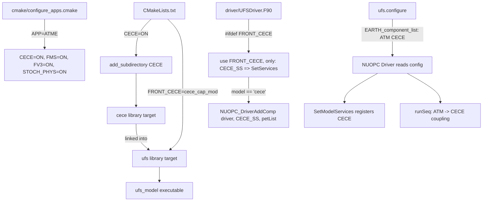

# Design Document: CECE UFS Integration

## Overview

This design describes how to integrate CECE (Chemistry/Emissions Computation Engine) into the UFS weather model as a first-class NUOPC component. CECE already exists as a git submodule with a fully implemented NUOPC cap (`cece_cap_mod` in `CECE/src/cece_cap.F90`). The integration follows the established UFS pattern used by AQM, CDEPS, NOAHMP, GOCART, and other components — touching four layers:

1. **CMake build system** — Declare the `CECE` option, conditionally build the submodule, link it into the `ufs` library, and define the `FRONT_CECE` preprocessor macro.
2. **NUOPC driver** — Add preprocessor-guarded import and registration of `CECE_SetServices` in `driver/UFSDriver.F90`.
3. **Application configuration** — Add a new `ATME` application in `cmake/configure_apps.cmake` and register it in `VALID_APPS`.
4. **Runtime configuration** — Provide a `ufs.configure` template that lists CECE in the component list, defines its PET/thread settings, and places it in the run sequence after ATM.

No changes to the CECE cap itself are required — it already implements IPDv01 with `CECE_SetServices`, Advertise, Realize, Run, and Finalize phases.

## Architecture

The integration follows the existing UFS component plug-in architecture:



### Component Lifecycle in UFS

When CECE is enabled, the NUOPC driver manages it through the standard lifecycle:

1. **Build time**: CMake compiles CECE sources, links the `cece` target into `ufs`, and defines `FRONT_CECE`.
2. **Driver init**: `UFSDriver.F90` imports `CECE_SetServices` via the `FRONT_CECE` guard and registers it when `ufs.configure` specifies `CECE_model: cece`.
3. **NUOPC init**: The framework calls CECE's IPDv01 Advertise and Realize phases.
4. **Run loop**: The `runSeq::` block controls execution order — ATM runs, data flows to CECE, CECE runs, data flows back.
5. **Finalize**: CECE releases resources via its Finalize specialization.

## Components and Interfaces

### 1. Top-Level CMakeLists.txt Changes

**File**: `CMakeLists.txt`

Add the `CECE` cache variable alongside existing component options:

```cmake
set(CECE            OFF CACHE BOOL "Enable CECE")
```

Add status message:

```cmake
message("CECE ............. ${CECE}")
```

Add `ATME` to `VALID_APPS`:

```cmake
list(APPEND VALID_APPS ATM ATMAERO ATMAQ ATME ATMW ...)
```

Conditionally build and link CECE (placed after the AQM section):

```cmake
###############################################################################
### CECE
###############################################################################
if(CECE)
  add_subdirectory(CECE)
endif()
```

In the UFS library section, add CECE wiring (following the AQM pattern):

```cmake
if(CECE)
  add_dependencies(ufs cece)
  list(APPEND _ufs_defs_private FRONT_CECE=cece_cap_mod)
  list(APPEND _ufs_libs_public cece)
endif()
```

**Design Decision**: We build CECE directly via `add_subdirectory(CECE)` rather than creating a `CECE-interface/` wrapper directory. Rationale: CECE's own `CMakeLists.txt` already handles all dependencies (Kokkos, yaml-cpp, ESMF) via FetchContent and produces the `cece` library target. A wrapper is unnecessary — this matches the pattern used by AQM and GOCART which also build directly from their submodule directories.

### 2. Application Configuration

**File**: `cmake/configure_apps.cmake`

Add a new `ATME` application block:

```cmake
if(APP MATCHES "^(ATME)$")
  set(FMS        ON  CACHE BOOL "Enable FMS"                 FORCE)
  set(FV3        ON  CACHE BOOL "Enable FV3"                 FORCE)
  set(STOCH_PHYS ON  CACHE BOOL "Enable Stochastic Physics"  FORCE)
  set(CECE       ON  CACHE BOOL "Enable CECE"                FORCE)
  message("Configuring UFS app in Atmosphere with Emissions mode")
endif()
```

**Design Decision**: The application is named `ATME` (ATM-Emissions) following the `ATMAQ` naming convention (ATM + domain abbreviation). It enables FMS, FV3, and STOCH_PHYS as companion components — the minimum set required for an atmosphere-coupled run. CMEPS is not required because CECE couples directly with ATM through the NUOPC connector (same pattern as AQM).

### 3. Driver Registration

**File**: `driver/UFSDriver.F90`

Add the CECE import block (after the AQM block):

```fortran
  ! - Handle build time CECE options:
#ifdef FRONT_CECE
      use FRONT_CECE,       only: CECE_SS  => SetServices
#endif
```

Add the CECE registration block in `SetModelServices` (after the AQM block):

```fortran
#ifdef FRONT_CECE
          if (trim(model) == "cece") then
            !TODO: Remove bail code and pass info and SetVM to DriverAddComp
            !TODO: once component supports threading.
            if (ompNumThreads > 1) then
              write (msg, *) "ESMF-aware threading NOT implemented for model: "//&
                trim(model)
              call ESMF_LogSetError(ESMF_RC_NOT_VALID, msg=msg, line=__LINE__, &
                file=__FILE__, rcToReturn=rc)
              return  ! bail out
            endif
            call NUOPC_DriverAddComp(driver, trim(prefix), CECE_SS, &
              petList=petList, comp=comp, rc=rc)
            if (ChkErr(rc,__LINE__,u_FILE_u)) return
            found_comp = .true.
          end if
#endif
```

**Design Decision**: Threading is initially disabled (matching AQM, CDEPS, NOAHMP patterns) because CECE's Kokkos-based parallelism manages its own threading internally. The `TODO` comment follows the convention used by other components, signaling future ESMF-aware threading support.

### 4. Runtime Configuration Template

**File**: `tests/parm/ufs.configure.atme.IN`

```
#############################################
####  UFS Run-Time Configuration File  ######
#############################################

# ESMF #
logKindFlag:            @[esmf_logkind]
globalResourceControl:  @[ESMF_THREADING]

# EARTH #
EARTH_component_list: ATM CECE
EARTH_attributes::
  Verbosity = 0
::

# ATM #
ATM_model:                      @[atm_model]
ATM_petlist_bounds:             @[atm_petlist_bounds]
ATM_omp_num_threads:            @[atm_omp_num_threads]
ATM_attributes::
  Verbosity = 0
  Diagnostic = 0
::

# CECE #
CECE_model:                     @[cece_model]
CECE_petlist_bounds:            @[cece_petlist_bounds]
CECE_omp_num_threads:           @[cece_omp_num_threads]
CECE_attributes::
  Verbosity = 0
  ConfigFile = @[cece_config_file]
::

# Run Sequence #
runSeq::
  @[coupling_interval_sec]
    ATM
    ATM -> CECE
    CECE
    CECE -> ATM
  @
::
```

**Design Decision**: The run sequence places ATM first, then transfers meteorological fields to CECE, runs CECE, and transfers chemical species back to ATM. This mirrors the AQM coupling pattern. The `CECE_attributes::` section includes a `ConfigFile` attribute so the CECE cap can locate its YAML configuration file at runtime.

## Data Models

No new persistent data models are introduced by this integration. The data flow between components uses ESMF Fields managed by the NUOPC framework:

| Direction | Fields | Description |
|-----------|--------|-------------|
| ATM → CECE (import) | Meteorological fields (temperature, pressure, wind, humidity) | Advertised dynamically from CECE's meteorology registry |
| CECE → ATM (export) | Chemical species concentrations | Advertised dynamically based on CECE's YAML configuration |

Field names are determined at runtime by the CECE cap's Advertise phase — they are not hardcoded in the UFS integration layer.

### Build System Data Flow

| Artifact | Source | Consumer |
|----------|--------|----------|
| `cece` library target | `CECE/CMakeLists.txt` | `CMakeLists.txt` (linked into `ufs`) |
| `FRONT_CECE` preprocessor macro | `CMakeLists.txt` | `driver/UFSDriver.F90` |
| `CECE` CMake option | `CMakeLists.txt` / `configure_apps.cmake` | Build system conditional logic |
| `ufs.configure` | `tests/parm/ufs.configure.atme.IN` | NUOPC driver at runtime |

## Error Handling

| Error Condition | Handler | Behavior |
|----------------|---------|----------|
| `CECE=ON` but CECE submodule not initialized | CMake `add_subdirectory` | CMake configuration fails with missing directory error |
| `FRONT_CECE` defined but `cece` library unavailable | CMake link step | Link error at build time |
| `CECE_model: cece` in config but `FRONT_CECE` not defined | `UFSDriver.F90` `SetModelServices` | `found_comp` remains `.false.`, driver logs error "No component cece found" and returns `ESMF_RC_NOT_VALID` |
| `cece_omp_num_threads > 1` | `UFSDriver.F90` `SetModelServices` | Driver logs "ESMF-aware threading NOT implemented for model: cece" and returns `ESMF_RC_NOT_VALID` |
| CECE core init failure (Kokkos, YAML parse, etc.) | `cece_cap.F90` Advertise/Realize phases | Cap returns non-success `rc` to driver, driver propagates error |
| CECE missing from `EARTH_component_list` but referenced in `runSeq` | NUOPC framework | NUOPC reports unresolved component in run sequence |
| CECE dependency (Kokkos/yaml-cpp) fetch fails | CECE's FetchContent | CMake configuration fails with download/build error |

## Testing Strategy

### Why Property-Based Testing Does Not Apply

This feature is a build system and driver integration task. All changes are:
- **CMake configuration** (declaring options, adding subdirectories, defining macros) — declarative IaC
- **Fortran preprocessor wiring** (conditional imports and registration) — compile-time correctness
- **Runtime configuration templates** (INI-style config files) — static file content

There are no pure functions with varying inputs, no data transformations, no parsers or serializers to round-trip. The acceptance criteria map entirely to SMOKE, INTEGRATION, and EXAMPLE test categories. Property-based testing is not appropriate.

### Test Approach

**Smoke Tests** (build system verification):
- Configure CMake with `CECE=OFF` and verify no CECE artifacts are produced
- Configure CMake with `APP=ATME` and verify `CECE=ON`, `FMS=ON`, `FV3=ON`, `STOCH_PHYS=ON`
- Verify `FRONT_CECE=cece_cap_mod` appears in compile definitions when `CECE=ON`
- Verify `ATME` is in the `VALID_APPS` list
- Verify `ufs.configure.atme.IN` contains required sections (EARTH_component_list, CECE_model, CECE_attributes, runSeq)

**Integration Tests** (build and link verification):
- Full build with `APP=ATME` succeeds and produces `ufs_model` executable
- CECE's dependencies (Kokkos, yaml-cpp, ESMF) resolve without errors
- The `ufs` library links against the `cece` target without unresolved symbols
- Build with `CECE=OFF` succeeds without any CECE-related errors (isolation check)

**Example Tests** (specific scenarios):
- Driver rejects `CECE_model: cece` with `cece_omp_num_threads: 2` (threading guard)
- Driver reports error when `CECE_model: cece` is specified but `FRONT_CECE` is not defined
- Run sequence in template has ATM before CECE with correct ATM→CECE and CECE→ATM transfers
- CECE cap returns non-success rc when core initialization is deliberately failed
