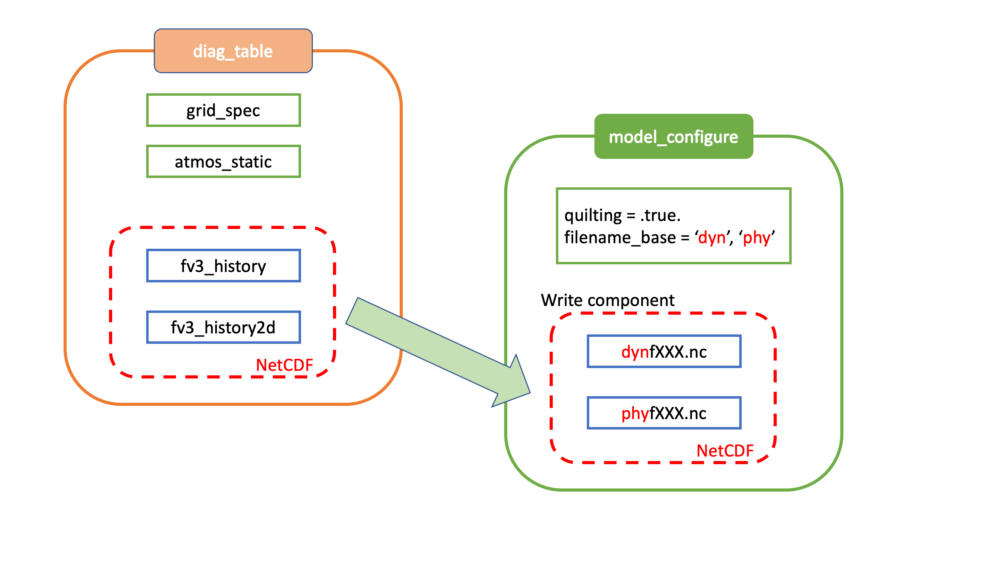

.. _InputsOutputs:

*****************************************************
Data: Input, Model Configuration, and Output Files
*****************************************************

The UFS Weather Model can be run in one of several configurations (sometimes referred to as "applications"), from a single-component atmospheric 
model to a fully coupled model with multiple earth system components (e.g., atmosphere, ocean, sea-ice and 
mediator). Currently, supported configurations include:

.. _UFS-configurations:

.. list-table:: *Supported ufs-weather-model applications*
   :widths: 10 70
   :header-rows: 1

   * - Configuration Name
     - Description
   * - :ref:`ATM <atm>`
     - Standalone Atmospheric Model (:term:`ATM`)
   * - :ref:`ATMW <atmw>`
     - :term:`ATM` coupled to :term:`WW3`
   * - :ref:`ATMAERO <atmaero>`
     - :term:`ATM` coupled to :term:`GOCART`
   * - :ref:`ATMAQ <atmaq>`
     - :term:`ATM` coupled to :term:`CMAQ`
   * - :ref:`ATML <atml>`
     - :term:`ATM` coupled to :term:`LND`
   * - :ref:`S2S <s2s>`
     - Coupled :term:`ATM` - :term:`MOM6` - :term:`CICE6` - :term:`CMEPS`
   * - :ref:`S2SA <s2sa>`
     - Coupled :term:`ATM` - :term:`MOM6` - :term:`CICE6` - :term:`GOCART` - :term:`CMEPS`
   * - :ref:`S2SW <s2sw>`
     - Coupled :term:`ATM` - :term:`MOM6` - :term:`CICE6` - :term:`WW3` - :term:`CMEPS`
   * - :ref:`S2SWA <s2swa>`
     - Coupled :term:`ATM` - :term:`MOM6` - :term:`CICE6` - :term:`GOCART` - :term:`WW3` - :term:`CMEPS`
   * - :ref:`NG-GODAS <ng-godas>`
     - Coupled :term:`CDEPS` - :term:`DATM` - :term:`MOM6` - :term:`CICE6` - :term:`CMEPS`
   * - :ref:`LND <lnd>`
     - Coupled :term:`CDEPS` - :term:`DATM` - :term:`LND` -:term:`CMEPS`
   * - :ref:`HAFS <hafs>`
     - Coupled :term:`ATM` - :term:`HYCOM` - :term:`CMEPS`
   * - :ref:`HAFSW <hafsw>`
     - Coupled :term:`ATM` - :term:`HYCOM` - :term:`WW3` - :term:`CMEPS`
   * - :ref:`HAFS-ALL <hafs-all>`
     - Coupled :term:`CDEPS` - :term:`ATM` - :term:`HYCOM` - :term:`WW3` - :term:`CMEPS`

.. COMMENT: Should HAFS-ALL be DATM instead of ATM?

This chapter describes the input and output files needed for executing the model in the various supported configurations (see :numref:`Table %s <UFS-configurations>`). Each of the component models for a given configuration requires specific input files, and each component model outputs a particular set of files. Each configuration requires a set of model configuration files, as well. This chapter describes the input and output files involved with each component model. It also discusses the various configuration files involved in running the model. Users will need to view the input file requirements for each component model involved in the configuration they are running. For example, users running the *S2S* configuration would need to gather input data required for the *ATM*, *MOM6*, and *CICE6* component models. Then, they would need to alter certain model configuration files to reflect the ``ufs-weather-model`` configuration that they plan to run. 

=============
Input files
=============

There are three types of files needed to execute a run: 

   #. Static datasets (*fix* files containing climatological information)
   #. Files that depend on grid resolution and initial/boundary conditions 
   #. Model configuration files (such as namelists)

Information on the first two types of file appears in detail below for each component model. Information on Model Configuration files can be viewed in :numref:`Section %s <model-config-files>`. 

.. _atm-in:

-------
ATM
-------

.. _atm-fix-files:

^^^^^^^^^^^^^^^^^^^^^^^^^^^^^^^^^^^^^^^^^^^^^
Static Datasets (i.e., *fix files*)
^^^^^^^^^^^^^^^^^^^^^^^^^^^^^^^^^^^^^^^^^^^^^
The static input files for global configurations are listed and described in :numref:`Table %s <FixFiles>`. Similar files are used for a regional grid but are grid-specific and generated by pre-processing utilities (e.g., `UFS_UTILS <https://github.com/ufs-community/UFS_UTILS>`__).

.. _FixFiles:

.. list-table:: *Fix files containing climatological information*
   :widths: 40 50
   :header-rows: 1

   * - Filename
     - Description
   * - aerosol.dat
     - External aerosols data file
   * - CFSR.SEAICE.1982.2012.monthly.clim.grb
     - CFS reanalysis of monthly sea ice climatology
   * - co2historicaldata_YYYY.txt
     - Monthly CO2 in PPMV data for year YYYY
   * - global_albedo4.1x1.grb
     - Four albedo fields for seasonal mean climatology: 2 for strong zenith angle dependent (visible and near IR)
       and 2 for weak zenith angle dependent
   * - global_glacier.2x2.grb
     - Glacier points, permanent/extreme features
   * - global_h2oprdlos.f77
     - Coefficients for the parameterization of photochemical production and loss of water (H2O)
   * - global_maxice.2x2.grb
     - Maximum ice extent, permanent/extreme features
   * - global_mxsnoalb.uariz.t126.384.190.rg.grb
     - Climatological maximum snow albedo
   * - global_o3prdlos.f77
     - Monthly mean ozone coefficients
   * - global_shdmax.0.144x0.144.grb
     - Climatological maximum vegetation cover
   * - global_shdmin.0.144x0.144.grb
     - Climatological minimum vegetation cover
   * - global_slope.1x1.grb
     - Climatological slope type
   * - global_snoclim.1.875.grb
     - Climatological snow depth
   * - global_snowfree_albedo.bosu.t126.384.190.rg.grb
     - Climatological snowfree albedo
   * - global_soilmgldas.t126.384.190.grb
     - Climatological soil moisture
   * - global_soiltype.statsgo.t126.384.190.rg.grb
     - Soil type from the STATSGO dataset
   * - global_tg3clim.2.6x1.5.grb
     - Climatological deep soil temperature
   * - global_vegfrac.0.144.decpercent.grb
     - Climatological vegetation fraction
   * - global_vegtype.igbp.t126.384.190.rg.grb
     - Climatological vegetation type
   * - global_zorclim.1x1.grb
     - Climatological surface roughness
   * - RTGSST.1982.2012.monthly.clim.grb
     - Monthly, climatological, real-time global sea surface temperature
   * - seaice_newland.grb
     - High resolution land mask
   * - sfc_emissivity_idx.txt
     - External surface emissivity data table
   * - solarconstant_noaa_an.txt
     - External solar constant data table

.. _atm-grid-ic-files:

^^^^^^^^^^^^^^^^^^^^^^^^^^^^^^^^^^^^^^^^^^^^^
Grid Description and Initial Condition Files
^^^^^^^^^^^^^^^^^^^^^^^^^^^^^^^^^^^^^^^^^^^^^
The input files containing grid information and the initial conditions for global configurations are listed and described in :numref:`Table %s <GridICFiles>`. The input files for a limited area model (LAM) configuration, including grid information and initial and lateral boundary conditions, are listed and described in :numref:`Table %s <RegionalGridICFiles>`. Note that the regional grid is referred to as Tile 7 here, and it is generated by several pre-processing utilities.

.. _GridICFiles:

.. list-table:: *Input files containing grid information and initial conditions for global configurations*
   :widths: 35 50 15
   :header-rows: 1

   * - Filename
     - Description
     - Date-dependent
   * - Cxx_grid.tile[1-6].nc
     - Cxx grid information for tiles 1-6, where 'xx' is the grid number
     -
   * - gfs_ctrl.nc
     - NCEP NGGPS tracers, ak, and bk
     - ✔
   * - gfs_data.tile[1-6].nc
     - Initial condition fields (ps, u, v, u, z, t, q, O3). May include spfo3, spfo, spf02 if multiple gases are used
     - ✔
   * - oro_data.tile[1-6].nc
     - Model terrain (topographic/orographic information) for grid tiles 1-6
     -
   * - sfc_ctrl.nc
     - Control parameters for surface input: forecast hour, date, number of soil levels
     -
   * - sfc_data.tile[1-6].nc
     - Surface properties for grid tiles 1-6
     - ✔

.. _RegionalGridICFiles:

.. list-table:: *Regional input files containing grid information and initial and lateral boundary conditions for regional configurations*
   :widths: 35 50 15
   :header-rows: 1

   * - Filename
     - Description
     - Date-dependent
   * - Cxx_grid.tile7.nc
     - Cxx grid information for tile 7, where 'xx' is the grid number
     -
   * - gfs_ctrl.nc
     - NCEP NGGPS tracers, ak, and bk
     - ✔
   * - gfs_bndy.tile7.HHH.nc
     - Lateral boundary conditions at hour HHH
     - ✔
   * - gfs_data.tile7.nc
     - Initial condition fields (ps, u, v, u, z, t, q, O3). May include spfo3, spfo, spf02 if multiple gases are used
     - ✔
   * - oro_data.tile7.nc
     - Model terrain (topographic/orographic information) for grid tile 7
     -
   * - sfc_ctrl.nc
     - Control parameters for surface input: forecast hour, date, number of soil levels
     -
   * - sfc_data.tile7.nc
     - Surface properties for grid tile 7
     - ✔

.. _mom-in:

-------
MOM6
-------

.. _mom-fix-files:

^^^^^^^^^^^^^^^^^^^^^^^^^^^^^^^^^^^^^^^^^^^^^
Static Datasets (i.e., *fix files*)
^^^^^^^^^^^^^^^^^^^^^^^^^^^^^^^^^^^^^^^^^^^^^

The static input files for global configurations are listed and described in :numref:`Table %s <MOM6_FixFiles>`.

.. _MOM6_FixFiles:

.. list-table:: *Fix files containing climatological information*
   :widths: 40 50 15
   :header-rows: 1

   * - Filename
     - Description
     - Used in resolution
   * - runoff.daitren.clim.1440x1080.v20180328.nc
     - climatological runoff
     - 0.25
   * - runoff.daitren.clim.720x576.v20180328.nc
     - climatological runoff
     - 0.50
   * - seawifs-clim-1997-2010.1440x1080.v20180328.nc
     - climatological chlorophyll concentration in sea water
     - 0.25
   * - seawifs-clim-1997-2010.720x576.v20180328.nc
     - climatological chlorophyll concentration in sea water
     - 0.50
   * - seawifs_1998-2006_smoothed_2X.nc
     - climatological chlorophyll concentration in sea water
     - 1.00
   * - tidal_amplitude.v20140616.nc
     - climatological tide amplitude
     - 0.25
   * - tidal_amplitude.nc
     - climatological tide amplitude
     - 0.50, 1.00
   * - geothermal_davies2013_v1.nc
     - climatological geothermal heat flow
     - 0.50, 0.25
   * - KH_background_2d.nc
     - climatological 2-d background harmonic viscosities
     - 1.00

.. _mom-grid-ic-files:

^^^^^^^^^^^^^^^^^^^^^^^^^^^^^^^^^^^^^^^^^^^^^
Grid Description and Initial Condition Files
^^^^^^^^^^^^^^^^^^^^^^^^^^^^^^^^^^^^^^^^^^^^^

The input files containing grid information and the initial conditions for global configurations are listed and described in :numref:`Table %s <MOM6_GridICFiles>`.

.. _MOM6_GridICFiles:

.. list-table:: *Input files containing grid information and initial conditions for global configurations*
   :widths: 10 30 10 5
   :header-rows: 1
   
   * - Filename
     - Description
     - Valid RES options
     - Date-dependent
   * - ocean_hgrid.nc
     - horizonal grid information
     - 1.00, 0.50, 0.25
     -
   * - ocean_mosaic.nc
     - specify horizonal starting and ending points index
     - 1.00, 0.50, 0.25
     -
   * - ocean_topog.nc
     - ocean topography
     - 1.00, 0.50, 0.25
     -
   * - ocean_mask.nc
     - lans/sea mask
     - 1.00, 0.50, 0.25
     -
   * - hycom1_75_800m.nc
     - vertical coordinate level thickness
     - 1.00, 0.50, 0.25
     -
   * - layer_coord.nc
     - vertical layer target potential density
     - 1.00, 0.50, 0.25
     -
   * - All_edits.nc
     - specify grid points where topography are manually modified to adjust throughflow strength for narrow channels
     - 0.25
     -
   * - topo_edits_011818.nc
     - specify grid points where topography are manually modified to adjust throughflow strength for narrow channels
     - 1.00
     -
   * - MOM_channels_global_025
     - specifies restricted channel widths
     - 0.50, 0.25
     -
   * - MOM_channel_SPEAR
     - specifies restricted channel widths
     - 1.00
     -
   * - interpolate_zgrid_40L.nc
     - specify target depth for output
     - 1.00, 0.50, 0.25
     -
   * - MOM.res*nc
     - ocean initial conditions (from CPC ocean DA)
     - 0.25
     - ✔
   * - MOM6_IC_TS.nc
     - ocean temperature and salinity initial conditions (from CFSR)
     - 1.00, 0.50, 0.25
     - ✔

.. _hycom-in:

-------
HYCOM
-------

.. _hycom-fix-files:

^^^^^^^^^^^^^^^^^^^^^^^^^^^^^^^^^^^^^^^^^^^^^
Static Datasets (i.e., *fix files*)
^^^^^^^^^^^^^^^^^^^^^^^^^^^^^^^^^^^^^^^^^^^^^

Static input files have been created for several regional domains. These domains are listed and described in :numref:`Table %s <HYCOM_DomainIdentifiers>`.

.. _HYCOM_DomainIdentifiers:

.. list-table:: *The following table describes each domain identifier.*
   :widths: 10 20
   :header-rows: 1

   * - Identifier
     - Description
   * - hat10
     - Hurricane North Atlantic (1/12 degree)
   * - hep20
     - Hurricane Eastern North Pacific (1/12 degree)
   * - hwp30
     - Hurricane Western North Pacific (1/12 degree)
   * - hcp70
     - Hurricane Central North Pacific (1/12 degree)

Static input files are listed and described in :numref:`Table %s <HYCOM_FixFiles>`. Several datasets contain both dot-a (.a) and dot-b (.b) files. Dot-a files contain data written as 32-bit IEEE real values (idm*jdm) and dot-b files contain plain text metadata for each field in the dot-a file.

.. COMMENT: What is (idm*jdm)?

.. _HYCOM_FixFiles:

.. list-table:: *Fix files containing climatological information*
   :widths: 15 30 15
   :header-rows: 1

   * - Filename
     - Description
     - Domain
   * - :ref:`blkdat.input<HYCOM_BlkdatInput>`
     - Model input parameters
     -
   * - patch.input
     - Tile description
     -
   * - ports.input
     - Open boundary cells
     -
   * - forcing.chl.(a,b)
     - Chlorophyll (monthly climatology)
     - hat10, hep20, hwp30, hcp70
   * - forcing.rivers.(a,b)
     - River discharge (monthly climatology)
     - hat10, hep20, hwp30, hcp70
   * - iso.sigma.(a,b)
     - Fixed sigma thickness
     - hat10, hep20, hwp30, hcp70
   * - regional.depth.(a,b)
     - Total depth of ocean
     - hat10, hep20, hwp30, hcp70
   * - regional.grid.(a,b)
     - Grid information for HYCOM "C" grid
     - hat10, hep20, hwp30, hcp70
   * - relax.rmu.(a,b)
     - Open boundary nudging value
     - hat10, hep20, hwp30, hcp70
   * - relax.ssh.(a,b)
     - Surface height nudging value (monthly climatology)
     - hat10, hep20, hwp30, hcp70
   * - tbaric.(a,b)
     - Thermobaricity correction
     - hat10, hep20, hwp30, hcp70
   * - thkdf4.(a,b)
     - Diffusion velocity (m/s) for Laplacian thickness diffusivity
     - hat10, hep20, hwp30, hcp70
   * - veldf2.(a,b)
     - Diffusion velocity (m/s) for biharmonic momentum dissipation
     - hat10, hep20, hwp30, hcp70
   * - veldf4.(a,b)
     - Diffusion velocity (m/s) for Laplacian momentum dissipation
     - hat10, hep20, hwp30, hcp70

.. _hycom-grid-ic-files:

^^^^^^^^^^^^^^^^^^^^^^^^^^^^^^^^^^^^^^^^^^^^^^^
Grid Description and Initial Condition Files
^^^^^^^^^^^^^^^^^^^^^^^^^^^^^^^^^^^^^^^^^^^^^^^

The input files containing time dependent configuration and forcing data are listed and described in :numref:`Table %s <HYCOM_GridICFiles>`. These files are generated for specific regional domains (see :numref:`Table %s <HYCOM_DomainIdentifiers>`) during ocean prep. When uncoupled, the the forcing data drives the ocean model. When coupled, the forcing data is used to fill in unmapped grid cells. Several datasets contain both dot-a (.a) and dot-b (.b) files. Dot-a files contain data written as 32-bit IEEE real values (idm*jdm) and dot-b files contain plain text metadata for each field in the dot-a file.

.. COMMENT: What is (idm*jdm)?

.. _HYCOM_GridICFiles:

.. list-table:: *Input files containing grid information, initial conditions, and forcing data for regional configurations.*
   :widths: 12 30 18 5
   :header-rows: 1

   * - Filename
     - Description
     - Domain
     - Date-dependent
   * - limits
     - Model begin and end time (since HYCOM epoch)
     -
     - ✔
   * - forcing.airtmp.(a,b)
     - GFS forcing data for 2m air temperature
     - hat10, hep20, hwp30, hcp70
     - ✔
   * - forcing.mslprs.(a,b)
     - GFS forcing data for mean sea level pressure (symlink)
     - hat10, hep20, hwp30, hcp70
     - ✔
   * - forcing.precip.(a,b)
     - GFS forcing data for precipitation rate
     - hat10, hep20, hwp30, hcp70
     - ✔
   * - forcing.presur.(a,b)
     - GFS forcing data for mean sea level pressure
     - hat10, hep20, hwp30, hcp70
     - ✔
   * - forcing.radflx.(a,b)
     - GFS forcing data for total radiation flux
     - hat10, hep20, hwp30, hcp70
     - ✔
   * - forcing.shwflx.(a,b)
     - GFS forcing data for net downward shortwave radiation flux
     - hat10, hep20, hwp30, hcp70
     - ✔
   * - forcing.surtmp.(a,b)
     - GFS forcing data for surface temperature
     - hat10, hep20, hwp30, hcp70
     - ✔
   * - forcing.tauewd.(a,b)
     - GFS forcing data for eastward momentum flux
     - hat10, hep20, hwp30, hcp70
     - ✔
   * - forcing.taunwd.(a,b)
     - GFS forcing data for northward momentum flux
     - hat10, hep20, hwp30, hcp70
     - ✔
   * - forcing.vapmix.(a,b)
     - GFS forcing data for 2m vapor mixing ratio
     - hat10, hep20, hwp30, hcp70
     - ✔
   * - forcing.wndspd.(a,b)
     - GFS forcing data for 10m wind speed
     - hat10, hep20, hwp30, hcp70
     - ✔
   * - restart_in.(a,b)
     - Restart file for ocean state variables
     - hat10, hep20, hwp30, hcp70
     - ✔

.. _cice-in:

-------
CICE6
-------

.. _cice-fix-files:

^^^^^^^^^^^^^^^^^^^^^^^^^^^^^^^^^^^^^^^^^^^^^
Static Datasets (i.e., *fix files*)
^^^^^^^^^^^^^^^^^^^^^^^^^^^^^^^^^^^^^^^^^^^^^

No fix files are required for CICE6.

.. _cice-grid-ic-files:

^^^^^^^^^^^^^^^^^^^^^^^^^^^^^^^^^^^^^^^^^^^^^^^
Grid Description and Initial Condition Files
^^^^^^^^^^^^^^^^^^^^^^^^^^^^^^^^^^^^^^^^^^^^^^^

The input files containing grid information and the initial conditions for global configurations are listed and described in :numref:`Table %s <CICE6_GridICFiles>`.

.. _CICE6_GridICFiles:

.. list-table:: *Input files containing grid information and initial conditions for global configurations*
   :widths: 35 35 25 15
   :header-rows: 1

   * - Filename
     - Description
     - Valid RES options
     - Date-dependent
   * - cice_model_RES.res_YYYYMMDDHH.nc
     - cice model IC or restart file
     - 1.00, 0.50, 0.25
     - ✔
   * - grid_cice_NEMS_mxRES.nc
     - cice model grid at resolution RES
     - 100, 050, 025
     -
   * - kmtu_cice_NEMS_mxRES.nc
     - cice model land mask at resolution RES
     - 100, 050, 025
     -

.. _ww3-in:

-------
WW3
-------

.. _ww3-fix-files:

^^^^^^^^^^^^^^^^^^^^^^^^^^^^^^^^^^^^^^^^^^^^^
Static Datasets (i.e., *fix files*)
^^^^^^^^^^^^^^^^^^^^^^^^^^^^^^^^^^^^^^^^^^^^^

No fix files are required for WW3.

.. _ww3-grid-ic-files:

^^^^^^^^^^^^^^^^^^^^^^^^^^^^^^^^^^^^^^^^^^^^^^^
Grid Description and Initial Condition Files
^^^^^^^^^^^^^^^^^^^^^^^^^^^^^^^^^^^^^^^^^^^^^^^

The files for global configurations are listed and described in :numref:`Table %s <WW3_FixFiles>` for GFSv16 setup and :numref:`Table %s <WW3_FixFilesp>` for single grid configurations.
The model definitions for wave grid(s) including spectral and directional resolutions, time steps, numerical scheme and parallelization algorithm, the physics parameters, boundary conditions and grid definitions are stored in binary mod_def files. The aforementioned parameters are defined in ww3_grid.inp.<grd> and the ww3_grid executables generates the binary mod_def.<grd> files.

The WW3 version number in mod_def.<grd> files must be consistent with version of the code in ufs-weather-model. createmoddefs/creategridfiles.sh can be used in order to generate the mod_def.<grd> files, using ww3_grid.inp.<grd>, using the WW3 version in ufs-weather-model. In order to do it, the path to the location of the ufs-weather-model  (UFSMODELDIR), the path to generated mod_def.<grd> outputs (OUTDIR), the path to input ww3_grid.inp.<grd> files (SRCDIR) and the path to the working directory for log files (WORKDIR) should be defined.

.. _WW3_FixFiles:

.. list-table:: *Input files containing grid information and conservative remapping for global configurations (GFSv16 Wave)*
   :widths: 30 35 20 10 10
   :header-rows: 1

   * - Filename
     - Description
     - Spatial Resolution
     - nFreq
     - nDir
   * - mod_def.aoc_9km
     - Antarctic Ocean PolarStereo [50N 90N]
     - 9km
     - 50
     - 36
   * - mod_def.gnh_10m
     - Global mid core [15S 52N]
     - 10 min
     - 50
     - 36
   * - mod_def.gsh_15m
     - southern ocean [79.5S 10.5S]
     - 15 min
     - 50
     - 36
   * - mod_def.glo_15mxt
     - Global 1/4 extended grid [90S 90S]
     - 15 min
     - 36
     - 24
   * - mod_def.points
     - GFSv16-wave spectral grid point output
     - na
     - na
     - na
   * - rmp_src_to_dst_conserv_002_001.nc
     - Conservative remapping gsh_15m to gnh_10m
     - na
     - na
     - na
   * - rmp_src_to_dst_conserv_003_001.nc
     - Conservative remapping aoc_9km to gnh_10m
     - na
     - na
     - na

.. _WW3_FixFilesp:

.. list-table:: *Input grid information for single global/regional configurations*
   :widths: 30 50 20 10 10
   :header-rows: 1

   * - Filename
     - Description
     - Spatial Resolution
     - nFreq
     - nDir
   * - mod_def.ant_9km
     - Regional polar stereo antarctic grid [90S 50S]
     - 9km
     - 36
     - 24
   * - mod_def.glo_10m
     - Global grid [80S 80N]
     - 10 min
     - 36
     - 24
   * - mod_def.glo_30m
     - Global grid [80S 80N]
     - 30 min
     - 36
     - 36
   * - mod_def.glo_1deg
     - Global grid [85S 85N]
     - 1 degree
     - 25
     - 24
   * - mod_def.glo_2deg
     - Global grid [85S 85N]
     - 2 degree
     - 20
     - 18
   * - mod_def.glo_5deg
     - Global grid [85S 85N]
     - 5 degree
     - 18
     - 12
   * - mod_def.glo_gwes_30m
     - Global NAWES 30 min wave grid [80S 80N]
     - 30 min
     - 36
     - 36
   * - mod_def.natl_6m
     - Regional North Atlantic Basin [1.5N 45.5N; 98W 8W]
     - 6 min
     - 50
     - 36

Coupled regional configurations require forcing files to fill regions that cannot be interpolated from the atmospheric component. For a list of forcing files used to fill unmapped data points see :numref:`Table %s <WW3_ForcingFiles>`.

.. _WW3_ForcingFiles:

.. list-table:: *Forcing information for single regional configurations*
   :widths: 30 50 20
   :header-rows: 1

   * - Filename
     - Description
     - Resolution
   * - wind.natl_6m
     - Interpolated wind data from GFS
     - 6 min

The model driver input (ww3_multi.inp) includes the input, model and output grids definition, the starting and ending times for the entire model run and output types and intervals. The ww3_multi.inp.IN template is located under tests/parm/ directory. The inputs are described hereinafter:

.. _WW3_Driver:

.. list-table:: *Model driver input*
   :widths: 30 70
   :header-rows: 1

   * - NMGRIDS
     - Number of wave model grids
   * - NFGRIDS
     - Number of grids defining input fields
   * - FUNIPNT
     - Flag for using unified point output file.
   * - IOSRV
     - Output server type
   * - FPNTPROC
     - Flag for dedicated process for unified point output
   * - FGRDPROC
     - Flag for grids sharing dedicated output processes

If there are input data grids defined ( ``NFGRIDS > 0`` ) then these grids are defined first (``CPLILINE``, 
``WINDLINE``, ``ICELINE``, ``CURRLINE``). These grids are defined as if they are wave model grids using the 
file ``mod_def.<grd>``. Each grid is defined on a separate input line with ``<grd>``, with nine input flags identifying
$ the presence of 1) water levels 2) currents 3) winds 4) ice
$ 5) momentum 6) air density and 7-9) assimilation data.

The ``UNIPOINTS`` defines the name of this grid for all point output, which gathers the output spectral grid in a unified point output file.

The ``WW3GRIDLINE`` defines actual wave model grids using 13 parameters to be
read from a single line in the file for each. It includes (1) its own input grid ``mod_def.<grd>``, (2-10) 
forcing grid ids, (3) rank number, (12) group number and (13-14) fraction of communicator (processes) used for this grid.

``RUN_BEG`` and ``RUN_END`` define the starting and end times, ``FLAGMASKCOMP`` and ``FLAGMASKOUT`` are flags for masking at printout time (default F F), followed by the gridded and point outputs start time (``OUT_BEG``), interval (``DTFLD`` and ``DTPNT``) and end time (``OUT_END``). The restart outputs start time, interval and end time are define by ``RST_BEG``, ``DTRST``, ``RST_END`` respectively.

The ``OUTPARS_WAV`` defines gridded output fields. The ``GOFILETYPE``, ``POFILETYPE`` and ``RSTTYPE`` are gridded, point and restart output types respectively.

No initial condition files are required for WW3.

^^^^^^^^^^^^^^^^^^^^^^^^^^^^^^^^^^^^^^^^^^^^^
Mesh Generation
^^^^^^^^^^^^^^^^^^^^^^^^^^^^^^^^^^^^^^^^^^^^^

For coupled applications using the CMEPS mediator, an ESMF Mesh file describing the WW3 domain is required. For regional and sub-global domains, the mesh can be created using a two-step procedure.
 
   #. Generate a SCRIP format file for the domain
   #. Generate the ESMF Mesh.

In each case, the SCRIP file needs to be checked that it contains the right start and end latitudes and longitudes to match the ``mod_def`` file being used.

For the HAFS regional domain, the following commands can be used:

.. code-block:: console

   ncremap -g hafswav.SCRIP.nc -G latlon=441,901#snwe=1.45,45.55,-98.05,-7.95#lat_typ=uni#lat_drc=s2n
   ESMF_Scrip2Unstruct hafswav.SCRIP.nc mesh.hafs.nc 0

For the sub-global 1-deg domain extending from latitude 85.0S:

.. code-block:: console

   ncremap -g glo_1deg.SCRIP.nc -G latlon=171,360#snwe=-85.5,85.5,-0.5,359.5#lat_typ=uni#lat_drc=s2n
   ESMF_Scrip2Unstruct glo_1deg.SCRIP.nc mesh.glo_1deg.nc 0

For the sub-global 1/2-deg domain extending from latitude 80.0S:

.. code-block:: console

   ncremap -g gwes_30m.SCRIP.nc -G latlon=321,720#snwe=-80.25,80.25,-0.25,359.75#lat_typ=uni#lat_drc=s2n
   ESMF_Scrip2Unstruct gwes_30m.SCRIP.nc mesh.gwes_30m.nc 0

For the tripole grid, the mesh file is generated as part of the ``cpld_gridgen`` utility in
`UFS_UTILS <https://ufs-community.github.io/UFS_UTILS/cpld_gridgen/index.html>`__.

.. _cdeps-in:

-------
CDEPS
-------

.. _cdeps-fix-files:

^^^^^^^^^^^^^^^^^^^^^^^^^^^^^^^^^^^^^^^^^^^^^
Static Datasets (i.e., *fix files*)
^^^^^^^^^^^^^^^^^^^^^^^^^^^^^^^^^^^^^^^^^^^^^

No fix files are required for CDEPS.

.. _cdeps-grid-ic-files:

^^^^^^^^^^^^^^^^^^^^^^^^^^^^^^^^^^^^^^^^^^^^^^^
Grid Description and Initial Condition Files
^^^^^^^^^^^^^^^^^^^^^^^^^^^^^^^^^^^^^^^^^^^^^^^
The input files containing grid information and the time-varying forcing files for global configurations are listed and described in :numref:`Table %s <CDEPS_FilesATM>` and :numref:`Table %s <CDEPS_FilesOCN>`.

**Data Atmosphere**

.. _CDEPS_FilesATM:

.. list-table:: *Input files containing grid information and forcing files for global configurations*
   :widths: 35 50 15
   :header-rows: 1

   * - Filename
     - Description
     - Date-dependent
   * - cfsr_mesh.nc
     - ESMF mesh file for CFSR data source
     -
   * - gefs_mesh.nc
     - ESMF mesh file for GEFS data source
     -
   * - TL639_200618_ESMFmesh.nc
     - ESMF mesh file for ERA5 data source
     -
   * - cfsr.YYYYMMM.nc
     - CFSR forcing file for year YYYY and month MM
     - ✔
   * - gefs.YYYYMMM.nc
     - GEFS forcing file for year YYYY and month MM
     - ✔
   * - ERA5.TL639.YYYY.MM.nc
     - ERA5 forcing file for year YYYY and month MM
     - ✔

.. note:: 

   Users can find atmospheric forcing files for use with the land (:ref:`LND <lnd>`) component in the `Land Data Assimilation (DA) data bucket <https://registry.opendata.aws/noaa-ufs-land-da/>`__. These files provide atmospheric forcing data related to precipitation, solar radiation, longwave radiation, temperature, pressure, winds, humidity, topography, and mesh data. Forcing files for the land component configuration come from the Global Soil Wetness Project Phase 3 (`GSWP3 <https://hydro.iis.u-tokyo.ac.jp/GSWP3/>`__) dataset. 

   .. code-block:: console

      clmforc.GSWP3.c2011.0.5x0.5.Prec.1999-12.nc
      clmforc.GSWP3.c2011.0.5x0.5.Prec.2000-01.nc
      clmforc.GSWP3.c2011.0.5x0.5.Solr.1999-12.nc
      clmforc.GSWP3.c2011.0.5x0.5.Solr.2000-01.nc
      clmforc.GSWP3.c2011.0.5x0.5.TPQWL.1999-12.nc
      clmforc.GSWP3.c2011.0.5x0.5.TPQWL.2000-01.nc
      clmforc.GSWP3.c2011.0.5x0.5.TPQWL.SCRIP.210520_ESMFmesh.nc
      fv1.9x2.5_141008_ESMFmesh.nc
      topodata_0.9x1.25_USGS_070110_stream_c151201.nc
      topodata_0.9x1.SCRIP.210520_ESMFmesh.nc

   See the :ref:`Land DA User's Guide <landda:InputFiles>` or the :ref:`WM LND Input <lnd-in>` section of this page for more information on files used in land configurations of the UFS WM. 

**Data Ocean**

.. _CDEPS_FilesOCN:

.. list-table:: *Input files containing grid information and forcing files for global configurations*
   :widths: 35 50 15
   :header-rows: 1

   * - Filename
     - Description
     - Date-dependent
   * - TX025_210327_ESMFmesh_py.nc
     - ESMF mesh file for OISST data source
     -
   * - sst.day.mean.YYYY.nc
     - OISST forcing file for year YYYY
     - ✔

.. list-table:: *Input files containing grid information and forcing files for regional configurations*
   :widths: 35 50 15
   :header-rows: 1

   * - Filename
     - Description
     - Date-dependent
   * - hat10_210129_ESMFmesh_py.nc
     - ESMF mesh file for MOM6 data source
     -
   * - GHRSST_mesh.nc
     - ESMF mesh file for GHRSST data source
     -
   * - hycom_YYYYMM_surf_nolev.nc
     - MOM6 forcing file for year YYYY and month MM
     - ✔
   * - ghrsst_YYYYMMDD.nc
     - GHRSST forcing file for year YYYY, month MM and day DD
     - ✔

.. _gocart-in:

-------
GOCART
-------

.. _gocart-fix-files:

^^^^^^^^^^^^^^^^^^^^^^^^^^^^^^^^^^^^^^^^^^^^^
Static Datasets (i.e., *fix files*)
^^^^^^^^^^^^^^^^^^^^^^^^^^^^^^^^^^^^^^^^^^^^^

The static input files for GOCART configurations are listed and described in :numref:`Table %s <GOCART_ControlFiles>`.

.. _GOCART_ControlFiles:

.. list-table:: *GOCART run control files*
   :widths: 40 50
   :header-rows: 1

   * - Filename
     - Description
   * - AERO.rc
     - Atmospheric Model Configuration Parameters
   * - AERO_ExtData.rc
     - Model Inputs related to aerosol emissions
   * - AERO_HISTORY.rc
     - Create History List for Output
   * - AGCM.rc
     - Atmospheric Model Configuration Parameters
   * - CA2G_instance_CA.bc.rc
     - Resource file for Black Carbon parameters
   * - CA2G_instance_CA.br.rc
     - Resource file for Brown Carbon parameters
   * - CA2G_instance_CA.oc.rc
     - Resource file for Organic Carbon parameters
   * - CAP.rc
     - Meteorological fields imported from atmospheric model (CAP_imports) & Prognostic Tracers Table (CAP_exports)
   * - DU2G_instance_DU.rc
     - Resource file for Dust parameters
   * - GOCART2G_GridComp.rc
     - The basic properties of the GOCART2G Grid Components
   * - NI2G_instance_NI.rc
     - Resource file for Nitrate parameters
   * - SS2G_instance_SS.rc
     - Resource file for Sea Salt parameters
   * - SU2G_instance_SU.rc
     - Resource file for Sulfur parameters

GOCART inputs defined in ``AERO_ExtData`` are listed and described in :numref:`Table %s <GOCART_InputFiles>`.

.. _GOCART_InputFiles:

.. list-table:: *GOCART inputs defined in AERO_ExtData.rc*
   :widths: 40 50
   :header-rows: 1

   * - Filename
     - Description
   * - ExtData/dust
     - FENGSHA input files
   * - ExtData/QFED
     - QFED biomass burning emissions
   * - ExtData/CEDS
     - Anthropogenic emissions
   * - ExtData/MERRA2
     - DMS concentration
   * - ExtData/PIESA/sfc
     - Aviation emissions
   * - ExtData/PIESA/L127
     - H2O2, OH and NO3 mixing ratios
   * - ExtData/MEGAN_OFFLINE_BVOC
     - VOCs MEGAN biogenic emissions
   * - ExtData/monochromatic
     - Aerosol monochromatic optics files
   * - ExtData/optics
     - Aerosol radiation bands optic files for RRTMG
   * - ExtData/volcanic
     - SO2 volcanic pointwise sources
     
The static input files when using climatology (MERRA2) are listed and described in :numref:`Table %s <Climatology_InputFiles>`.

.. _Climatology_InputFiles:

.. list-table:: *Inputs when using climatology (MERRA2)*
   :widths: 40 50
   :header-rows: 1

   * - Filename
     - Description
   * - merra2.aerclim.2003-2014.m$(month).nc
     - MERRA2 aerosol climatology mixing ratio
   * - Optics_BC.dat
     - BC optical look-up table for MERRA2
   * - Optics_DU.dat
     - DUST optical look-up table for MERRA2
   * - Optics_OC.dat
     - OC optical look-up table for MERRA2
   * - Optics_SS.dat
     - Sea Salt optical look-up table for MERRA2
   * - Optics_SU.dat
     - Sulfate optical look-up table for MERRA2

.. _gocart-grid-ic-files:

^^^^^^^^^^^^^^^^^^^^^^^^^^^^^^^^^^^^^^^^^^^^^^^
Grid Description and Initial Condition Files
^^^^^^^^^^^^^^^^^^^^^^^^^^^^^^^^^^^^^^^^^^^^^^^

Running GOCART in UFS does not require aerosol initial conditions, as aerosol models can always start from scratch (cold start). However, this approach does require more than two weeks of model spin-up to obtain reasonable aerosol simulation results. Therefore, the most popular method is to take previous aerosol simulation results. The result is not necessarily from the same model; it could be from a climatology result, such as MERRA2, or from a different model but with the same aerosol species and bin/size distribution.

The aerosol initial input currently read by GOCART is the same format as the UFSAtm initial input data format of ``gfs_data_tile[1-6].nc`` in :numref:`Table %s <GridICFiles>`, so the aerosol initial conditions should be combined with the meteorological initial conditions as one initial input file. There are many tools available for this purpose. The `UFS_UTILS <https://github.com/ufs-community/UFS_UTILS>`__ preprocessing utilities provide a solution for this within the `Global Workflow <https://github.com/NOAA-EMC/global-workflow>`__.

.. _aqm-in:

--------------
AQM (CMAQ)
--------------

.. _aqm-fix-files:

^^^^^^^^^^^^^^^^^^^^^^^^^^^^^^^^^^^^^^^^^^^^^
Static Datasets (i.e., *fix files*)
^^^^^^^^^^^^^^^^^^^^^^^^^^^^^^^^^^^^^^^^^^^^^

The static input files for AQM configurations are listed and described in :numref:`Table %s <AQM_ControlFiles>`.

.. _AQM_ControlFiles:

.. list-table:: *AQM run control files*
   :widths: 40 50
   :header-rows: 1

   * - Filename
     - Description
   * - AQM.rc
     - NOAA Air Quality Model Parameters

AQM inputs defined in ``aqm.rc`` are listed and described in :numref:`Table %s <AQM_InputFiles>`.

.. _AQM_InputFiles:

.. list-table:: *AQM inputs defined in aqm.rc*
   :widths: 40 50
   :header-rows: 1

   * - Filename
     - Description
   * - AE_cb6r3_ae6_aq.nml 
     - AE Matrix NML
   * - GC_cb6r3_ae6_aq.nml 
     - GC Matrix NML
   * - NR_cb6r3_ae6_aq.nml 
     - NR Matrix NML
   * - Species_Table_TR_0.nml 
     - TR Matrix NML
   * - CSQY_DATA_cb6r3_ae6_aq
     - CSQY Data
   * - PHOT_OPTICS.dat
     - Optics Data
   * - omi_cmaq_2015_361X179.dat
     - OMI data
   * - NEXUS/NEXUS_Expt.nc
     - Emissions File
   * - BEIS_RRFScmaq_C775.ncf
     - Biogenic File
   * - gspro_biogenics_1mar2017.txt
     - Biogenic Speciation File
   * - Hourly_Emissions_regrid_rrfs_13km_20190801_t12z_h72.nc
     - File Emissions File 

.. _lnd-in:

-------
LND
-------

LND component datasets are available from the `Land Data Assimilation (DA) System data bucket <https://registry.opendata.aws/noaa-ufs-land-da/>`__ and can be retrieved using a ``wget`` command: 

.. code-block:: console

   wget https://noaa-ufs-land-da-pds.s3.amazonaws.com/current_land_da_release_data/v1.2.0/Landdav1.2.0_input_data.tar.gz
   tar xvfz Landdav1.2.0_input_data.tar.gz

These files will be untarred into an ``inputs`` directory if the user does not specify a different name. They include data for Dec. 21, 2019. :numref:`Table %s <LndInputFiles>` describes the file types. In each file name, ``YYYY`` refers to a valid 4-digit year, ``MM`` refers to a valid 2-digit month, and ``DD`` refers to a valid 2-digit day of the month. 

.. _LndInputFiles:

.. list-table:: *LND input files*
   :widths: 30 60 10
   :header-rows: 1

   * - Filename(s)
     - Description
     - File Type
   * - ufs-land_C96_init_fields.tile*.nc
     - Initial conditions files for each tile; the files include the initial state variables that are required for the UFS land snow DA to begin a cycling run. ``*`` stands for the grid tile number [1-6]. 
     - Initial conditions
   * - C96.maximum_snow_albedo.tile*.nc

       C96.slope_type.tile*.nc

       C96.soil_type.tile*.nc

       C96.soil_color.tile*.nc

       C96.substrate_temperature.tile*.nc

       C96.vegetation_greenness.tile*.nc

       C96.vegetation_type.tile*.nc

       oro_C96.mx100.tile*.nc
     - Tiled static files that contain information on maximum snow albedo, slope type, soil color and type, substrate temperature, vegetation greenness and type, and orography (grid and land mask information). ``*`` stands for the grid tile number [1-6]. 
     - Static/fixed files
   * - grid_spec.nc
     - Contains information on the mosaic grid
     - Grid
   * - C96_grid.tile*.nc
     - C96 grid information for tiles 1-6, where ``*`` is the grid tile number [1-6]. 
     - Grid
   * - C96_oro_data.tile*.nc / oro_C96.mx100.tileN.nc
     - Orography files that contain grid and land mask information, where ``*`` is the grid tile number [1-6]. ``mx100`` refers to the ocean resolution (100=1º).
     - Grid
   * - See :ref:`CDEPS <cdeps-in>` for information on atmospheric forcing files. 
     - Atmospheric forcing
     - CDEPS
   * - ghcn_snwd_ioda_YYYYMMDD.nc
     - GHCN snow depth data assimilation files
     - DA
   * - ufs_land_restart.YYYY-MM-DD_HH-mm-SS.nc
     - Restart file
     - Restart

.. _lnd-fix-files:

^^^^^^^^^^^^^^^^^^^^^^^^^^^^^^^^^^^^^^^^^^^^^
Static Datasets (i.e., *fix files*)
^^^^^^^^^^^^^^^^^^^^^^^^^^^^^^^^^^^^^^^^^^^^^

The static files (listed in :numref:`Table %s <LndInputFiles>`) include specific information on location, time, soil layers, and fixed (invariant) experiment parameters that are required for the land component to run. The data must be provided in :term:`netCDF` format.

The following static files are available in the ``inputs/UFS_WM/FV3_fix_tiled/C96/`` data directory (downloaded :ref:`above <lnd-in>`):

.. code-block:: 

   C96.maximum_snow_albedo.tile*.nc
   C96.slope_type.tile*.nc
   C96.soil_type.tile*.nc
   C96.soil_color.tile*.nc
   C96.substrate_temperature.tile*.nc
   C96.vegetation_greenness.tile*.nc
   C96.vegetation_type.tile*.nc
   oro_C96.mx100.tile*.nc

where ``*`` refers to the tile number (1-6). 
Details on the configuration variables included in this file are available in the :ref:`Land DA documentation <landda:InputFiles>`. 

.. _lnd-grid-ic-files:

^^^^^^^^^^^^^^^^^^^^^^^^^^^^^^^^^^^^^^^^^^^^^
Grid Description and Initial Condition Files
^^^^^^^^^^^^^^^^^^^^^^^^^^^^^^^^^^^^^^^^^^^^^

The input files containing grid information and the initial conditions for global configurations are listed and described in :numref:`Table %s <LndInputFiles>`. 

The initial conditions file includes the initial state variables that are required for the UFS land snow DA to begin a cycling run. The data must be provided in :term:`netCDF` format.
The initial conditions file is available in the ``inputs`` data directory (downloaded :ref:`above <lnd-in>`) at the following path:

.. code-block:: 

   inputs/UFS_WM/NOAHMP_IC/ufs-land_C96_init_fields.tile*.nc

Grid files are available in the ``inputs/UFS_WM/FV3_input_data/INPUT`` directory:

.. code-block::

   C96_grid.tile*.nc
   grid_spec.nc     # aka C96.mosaic.nc

The ``C96_grid.tile*.nc`` files contain grid information for tiles 1-6 at C96 grid resolution. The ``grid_spec.nc`` file contains information on the mosaic grid.

^^^^^^^^^^^^^^^^^^^^
Additional Files
^^^^^^^^^^^^^^^^^^^^

The LND component uses atmospheric forcing files, data assimilation files, and restart files, which are also listed in :numref:`Table %s <LndInputFiles>`. 

.. _model-config-files:

==========================
Model configuration files
==========================

The configuration files used by the UFS Weather Model are listed here and described below:

   * ``diag_table``
   * ``field_table``
   * ``model_configure``
   * ``ufs.configure``
   * ``suite_[suite_name].xml`` (used only at build time)
   * ``datm.streams`` (used by CDEPS)
   * ``datm_in`` (used by CDEPS)
   * ``blkdat.input`` (used by HYCOM)

While the ``input.nml`` file is also a configuration file used by the UFS Weather Model, it is described in
:numref:`Section %s <InputNML>`. The run-time configuration of model output fields is controlled by the combination of ``diag_table`` and ``model_configure``, and is described in detail in :numref:`Section %s <OutputFiles>`.

.. _diag_tableFile:

-------------------
``diag_table`` file
-------------------
There are three sections in file ``diag_table``: Header (Global), File, and Field. These are described below.

**Header Description**

The Header section must reside in the first two lines of the ``diag_table`` file and contain the title and date
of the experiment (see example below). The title must be a Fortran character string. The base date is the
reference time used for the time units, and must be greater than or equal to the model start time. The base date
consists of six space-separated integers in the following format: ``year month day hour minute second``.  Here is an example:

.. code-block:: console

   20161003.00Z.C96.64bit.non-mono
   2016 10 03 00 0 0

**File Description**

The File Description lines are used to specify the name of the file(s) to which the output will be written. They
contain one or more sets of six required and five optional fields (optional fields are denoted by square brackets
``[ ]``). The lines containing File Descriptions can be intermixed with the lines containing Field Descriptions as
long as files are defined before fields that are to be written to them. File entries have the following format:

.. code-block:: console

   "file_name", output_freq, "output_freq_units", file_format, "time_axis_units", "time_axis_name"
   [, new_file_freq, "new_file_freq_units"[, "start_time"[, file_duration, "file_duration_units"]]]

These file line entries are described in :numref:`Table %s <FileDescription>`.

.. _FileDescription:

.. list-table:: *Description of the six required and five optional fields used to define output file sampling rates.*
   :widths: 20 25 55
   :header-rows: 1

   * - File Entry
     - Variable Type
     - Description
   * - file_name
     - CHARACTER(len=128)
     - Output file name without the trailing ".nc"
   * - output_freq
     - INTEGER
     - | The period between records in the file_name:
       |  > 0  output frequency in output_freq_units.
       |  = 0  output frequency every time step (output_freq_units is ignored)
       |  =-1  output at end of run only (output_freq_units is ignored)
   * - output_freq_units
     - CHARACTER(len=10)
     - The units in which output_freq is given.  Valid values are "years", "months", "days", "minutes", "hours", or "seconds".
   * - file_format
     - INTEGER
     - Currently only the netCDF file format is supported.  = 1  netCDF
   * - time_axis_units
     - CHARACTER(len=10)
     - The units to use for the time-axis in the file.  Valid values are "years", "months", "days", "minutes", "hours",
       or "seconds".
   * - time_axis_name
     - CHARACTER(len=128)
     - Axis name for the output file time axis.  The character string must contain the string 'time'.
       (mixed upper and lowercase allowed.)
   * - new_file_freq
     - INTEGER, OPTIONAL
     - Frequency for closing the existing file, and creating a new file in new_file_freq_units.
   * - new_file_freq_units
     - CHARACTER(len=10), OPTIONAL
     - Time units for creating a new file:  either years, months, days, minutes, hours, or seconds.
       NOTE: If the new_file_freq field is present, then this field must also be present.
   * - start_time
     - CHARACTER(len=25), OPTIONAL
     - Time to start the file for the first time.  The format of this string is the same as the global date.
       NOTE: The new_file_freq and the new_file_freq_units fields must be present to use this field.
   * - file_duration
     - INTEGER, OPTIONAL
     - How long file should receive data after start time in file_duration_units.  This optional field can only be
       used if the start_time field is present.  If this field is absent, then the file duration will be equal to the
       frequency for creating new files.  NOTE: The file_duration_units field must also be present if this field is present.
   * - file_duration_units
     - CHARACTER(len=10), OPTIONAL
     - File duration units. Can be either years, months, days, minutes, hours, or seconds.  NOTE: If the file_duration field
       is present, then this field must also be present.

**Field Description**

The field section of the diag_table specifies the fields to be output at run time.  Only fields registered
with ``register_diag_field()``, which is an API in the FMS ``diag_manager`` routine, can be used in the ``diag_table``.

Registration of diagnostic fields is done using the following syntax

.. code-block:: console

   diag_id = register_diag_field(module_name, diag_name, axes, ...)

in file ``FV3/atmos_cubed_sphere/tools/fv_diagnostics.F90``.  As an example, the sea level pressure is registered as:

.. code-block:: console

   id_slp = register_diag_field (trim(field), 'slp', axes(1:2), &   Time, 'sea-level pressure', 'mb', missing_value=missing_value, range=slprange )

All data written out by ``diag_manager`` is controlled via the ``diag_table``.  A line in the field section of the
``diag_table`` file contains eight variables with the following format:

.. code-block:: console

   "module_name", "field_name", "output_name", "file_name", "time_sampling", "reduction_method", "regional_section", packing

These field section entries are described in :numref:`Table %s <FieldDescription>`.

.. _FieldDescription:

.. list-table:: *Description of the eight variables used to define the fields written to the output files.*
   :widths: 16 24 55
   :header-rows: 1

   * - Field Entry
     - Variable Type
     - Description
   * - module_name
     - CHARACTER(len=128)
     - Module that contains the field_name variable.  (e.g. dynamic, gfs_phys, gfs_sfc)
   * - field_name
     - CHARACTER(len=128)
     - The name of the variable as registered in the model.
   * - output_name
     - CHARACTER(len=128)
     - Name of the field as written in file_name.
   * - file_name
     - CHARACTER(len=128)
     - Name of the file where the field is to be written.
   * - time_sampling
     - CHARACTER(len=50)
     - Currently not used.  Please use the string "all".
   * - reduction_method
     - CHARACTER(len=50)
     - The data reduction method to perform prior to writing data to disk.  Current supported option is .false..  See ``FMS/diag_manager/diag_table.F90`` for more information.
   * - regional_section
     - CHARACTER(len=50)
     - Bounds of the regional section to capture. Current supported option is "none". See ``FMS/diag_manager/diag_table.F90`` for more information.
   * - packing
     - INTEGER
     - Fortran number KIND of the data written.  Valid values:  1=double precision, 2=float, 4=packed 16-bit integers, 8=packed 1-byte (not tested).

Comments can be added to the diag_table using the hash symbol (``#``).

A brief example of the diag_table is shown below.  ``"..."`` denotes where lines have been removed.

.. _code-block-fv3-diag-table:

.. code-block:: console

   20161003.00Z.C96.64bit.non-mono
   2016 10 03 00 0 0

   "grid_spec",     -1,  "months",   1, "days",  "time"
   "atmos_4xdaily",  6,  "hours",    1, "days",  "time"
   "atmos_static"   -1,  "hours",    1, "hours", "time"
   "fv3_history",    0,  "hours",    1, "hours", "time"
   "fv3_history2d",  0,  "hours",    1, "hours", "time"

   #
   #=======================
   # ATMOSPHERE DIAGNOSTICS
   #=======================
   ###
   # grid_spec
   ###
    "dynamics", "grid_lon",  "grid_lon",  "grid_spec", "all", .false.,  "none", 2,
    "dynamics", "grid_lat",  "grid_lat",  "grid_spec", "all", .false.,  "none", 2,
    "dynamics", "grid_lont", "grid_lont", "grid_spec", "all", .false.,  "none", 2,
    "dynamics", "grid_latt", "grid_latt", "grid_spec", "all", .false.,  "none", 2,
    "dynamics", "area",      "area",      "grid_spec", "all", .false.,  "none", 2,
   ###
   # 4x daily output
   ###
    "dynamics",  "slp",       "slp",      "atmos_4xdaily", "all", .false.,  "none", 2
    "dynamics",  "vort850",   "vort850",  "atmos_4xdaily", "all", .false.,  "none", 2
    "dynamics",  "vort200",   "vort200",  "atmos_4xdaily", "all", .false.,  "none", 2
    "dynamics",  "us",        "us",       "atmos_4xdaily", "all", .false.,  "none", 2
    "dynamics",  "u1000",     "u1000",    "atmos_4xdaily", "all", .false.,  "none", 2
    "dynamics",  "u850",      "u850",     "atmos_4xdaily", "all", .false.,  "none", 2
    "dynamics",  "u700",      "u700",     "atmos_4xdaily", "all", .false.,  "none", 2
    "dynamics",  "u500",      "u500",     "atmos_4xdaily", "all", .false.,  "none", 2
    "dynamics",  "u200",      "u200",     "atmos_4xdaily", "all", .false.,  "none", 2
    "dynamics",  "u100",      "u100",     "atmos_4xdaily", "all", .false.,  "none", 2
    "dynamics",  "u50",       "u50",      "atmos_4xdaily", "all", .false.,  "none", 2
    "dynamics",  "u10",       "u10",      "atmos_4xdaily", "all", .false.,  "none", 2

   ...
   ###
   # gfs static data
   ###
    "dynamics",  "pk",        "pk",       "atmos_static",  "all", .false.,  "none", 2
    "dynamics",  "bk",        "bk",       "atmos_static",  "all", .false.,  "none", 2
    "dynamics",  "hyam",     "hyam",      "atmos_static",  "all", .false.,  "none", 2
    "dynamics",  "hybm",     "hybm",       "atmos_static",  "all", .false.,  "none", 2
    "dynamics",  "zsurf",    "zsurf",      "atmos_static",  "all", .false.,  "none", 2
   ###
   # FV3 variables needed for NGGPS evaluation
   ###
   "gfs_dyn",    "ucomp",      "ugrd",     "fv3_history",    "all",  .false.,  "none",  2
   "gfs_dyn",    "vcomp",      "vgrd",     "fv3_history",    "all",  .false.,  "none",  2
   "gfs_dyn",    "sphum",      "spfh",     "fv3_history",    "all",  .false.,  "none",  2
   "gfs_dyn",    "temp",       "tmp",      "fv3_history",    "all",  .false.,  "none",  2
   ...
   "gfs_phys",  "ALBDO_ave",    "albdo_ave", "fv3_history2d", "all", .false., "none",  2
   "gfs_phys",  "cnvprcp_ave",  "cprat_ave", "fv3_history2d", "all", .false., "none",  2
   "gfs_phys",  "cnvprcpb_ave", "cpratb_ave","fv3_history2d", "all", .false., "none",  2
   "gfs_phys",  "totprcp_ave",  "prate_ave", "fv3_history2d", "all", .false., "none",  2
   ...
   "gfs_sfc",   "crain",   "crain",    "fv3_history2d",  "all",  .false.,  "none",  2
   "gfs_sfc",   "tprcp",   "tprcp",    "fv3_history2d",  "all",  .false.,  "none",  2
   "gfs_sfc",   "hgtsfc",  "orog",     "fv3_history2d",  "all",  .false.,  "none",  2
   "gfs_sfc",   "weasd",   "weasd",    "fv3_history2d",  "all",  .false.,  "none",  2
   "gfs_sfc",   "f10m",    "f10m",     "fv3_history2d",  "all",  .false.,  "none",  2
  ...

More information on the content of this file can be found in ``FMS/diag_manager/diag_table.F90``.

.. note:: None of the lines in the ``diag_table`` can span multiple lines.

.. _field_tableFile:

-----------------------
``field_table`` file
-----------------------
The FMS field and tracer managers are used to manage tracers and specify tracer options.  All tracers
advected by the model must be registered in an ASCII table called ``field_table``.  The field table consists
of entries in the following format:

The first line of an entry should consist of three quoted strings:
 - The first quoted string will tell the field manager what type of field it is. The string ``"TRACER"`` is used to
   declare a field entry.
 - The second quoted string will tell the field manager which model the field is being applied to.  The supported
   type at present is ``"atmos_mod"`` for the atmosphere model.
 - The third quoted string should be a unique tracer name that the model will recognize.

The second and following lines are called ``methods``.  These lines can consist of two or three quoted strings.
The first string will be an identifier that the querying module will ask for. The second string will be a name
that the querying module can use to set up values for the module. The third string, if present, can supply
parameters to the calling module that can be parsed and used to further modify values.

An entry is ended with a  forward slash (/) as the final character in a row.  Comments can be inserted in the field table by adding a hash symbol (#) as the first character in the line.

Below is an example of a field table entry for the tracer called ``"sphum"``:

.. code-block:: console

   # added by FRE: sphum must be present in atmos
   # specific humidity for moist runs
    "TRACER", "atmos_mod", "sphum"
              "longname",     "specific humidity"
              "units",        "kg/kg"
              "profile_type", "fixed", "surface_value=3.e-6" /

In this case, methods applied to this :term:`tracer` include setting the long name to "specific humidity", the units
to "kg/kg". Finally a field named "profile_type" will be given a child field called "fixed", and that field
will be given a field called "surface_value" with a real value of 3.E-6.  The "profile_type" options are listed
in :numref:`Table %s <TracerTable>`.  If the profile type is "fixed" then the tracer field values are set equal
to the surface value.  If the profile type is "profile" then the top/bottom of model and surface values are read
and an exponential profile is calculated, with the profile being dependent on the number of levels in the component model.

.. _TracerTable:

.. list-table:: *Tracer Profile Setup from FMS/tracer_manager/tracer_manager.F90.*
   :widths: 20 25 55
   :header-rows: 1

   * - Method Type
     - Method Name
     - Method Control
   * - profile_type
     - fixed
     - surface_value = X
   * - profile_type
     - profile
     - surface_value = X, top_value = Y (atmosphere)

For the case of

.. code-block:: console

   "profile_type","profile","surface_value = 1e-12, top_value = 1e-15"

in a 15 layer model this would return values of surf_value = 1e-12 and multiplier = 0.6309573,  i.e 1e-15 = 1e-12*(0.6309573^15).

A ``method`` is a way to allow a component module to alter the parameters it needs for various tracers. In essence,
this is a way to modify a default value. A namelist can supply default parameters for all tracers and a method, as
supplied through the field table, will allow the user to modify the default parameters on an individual tracer basis.
The lines in this file can be coded quite flexibly. Due to this flexibility, a number of restrictions are required.
See ``FMS/field_manager/field_manager.F90`` for more information.

.. _model_configureFile:

---------------------------
``model_configure`` file
---------------------------

This file contains settings and configurations for the NUOPC/ESMF main component, including the simulation
start time, the processor layout/configuration, and the I/O selections.  :numref:`Table %s <ModelConfigParams>`
shows the following parameters that can be set in ``model_configure`` at run-time.

.. _ModelConfigParams:

.. list-table:: *Parameters that can be set in model_configure at run-time.*
   :widths: 20 30 15 20
   :header-rows: 1

   * - Parameter
     - Meaning
     - Type
     - Default Value
   * - print_esmf
     - flag for ESMF PET files
     - logical
     - .true.
   * - start_year
     - start year of model integration
     - integer
     - 2019
   * - start_month
     - start month of model integration
     - integer
     - 09
   * - start_day
     - start day of model integration
     - integer
     - 12
   * - start_hour
     - start hour of model integration
     - integer
     - 00
   * - start_minute
     - start minute of model integration
     - integer
     - 0
   * - start_second
     - start second of model integration
     - integer
     - 0
   * - nhours_fcst
     - total forecast length
     - integer
     - 48
   * - dt_atmos
     - atmosphere time step in second
     - integer
     - 1800 (for C96)
   * - restart_interval
     - frequency to output restart file or forecast hours to write out restart file
     - integer
     - 0 (0: write restart file at the end of integration; 12, -1: write out restart every 12 hours; 12 24 write out restart files at fh=12 and 24)
   * - quilting
     - flag to turn on quilt
     - logical
     - .true.
   * - write_groups
     - total number of groups
     - integer
     - 2
   * - write_tasks_per_group
     - total number of write tasks in each write group
     - integer
     - 6
   * - output_history
     - flag to output history files
     - logical
     - .true.
   * - num_files
     - number of output files
     - integer
     - 2
   * - filename_base
     - file name base for the output files
     - character(255)
     - 'atm' 'sfc'
   * - output_grid
     - output grid
     - character(255)
     - gaussian_grid
   * - output_file
     - output file format
     - character(255)
     - netcdf
   * - imo
     - i-dimension for output grid
     - integer
     - 384
   * - jmo
     - j-dimension for output grid
     - integer
     - 190
   * - output_fh
     - history file output forecast hours or history file output frequency if the second elelment is -1
     - real
     - -1 (negative: turn off the option, otherwise overwritten nfhout/nfhout_fh; 6 -1: output every 6 hoursr; 6 9: output history files at fh=6 and 9. Note: output_fh can only take 1032 characters)

:numref:`Table %s <ModelConfigParamsNotChanged>` shows the following parameters in ``model_configure`` that
are not usually changed.

.. _ModelConfigParamsNotChanged:

.. list-table:: *Parameters that are not usually changed in model_configure at run-time.*
   :widths: 20 30 15 20
   :header-rows: 1

   * - Parameter
     - Meaning
     - Type
     - Default Value
   * - calendar
     - type of calendar year
     - character(*)
     - 'gregorian'
   * - fhrot
     - forecast hour at restart for nems/earth grid component clock in coupled model
     - integer
     - 0
   * - write_dopost
     - flag to do post on write grid component
     - logical
     - .true.
   * - write_nsflip
     - flag to flip the latitudes from S to N to N to S on output domain
     - logical
     - .false.
   * - ideflate
     - lossless compression level
     - integer
     - 1 (0:no compression, range 1-9)
   * - nbits
     - lossy compression level
     - integer
     - 14 (0: lossless, range 1-32)
   * - iau_offset
     - IAU offset lengdth
     - integer
     - 0

.. _ufs-conf:

------------------------
``ufs.configure`` file
------------------------

This file contains information about the various NEMS components and their run sequence. The active components for a particular model configuration are given in the *EARTH_component_list*. For each active component, the model name and compute tasks assigned to the component are given. A specific component might also require additional configuration information to be present. The ``runSeq`` describes the order and time intervals over which one or more component models integrate in time. Additional *attributes*, if present, provide additional configuration of the model components when coupled with the CMEPS mediator.

For the ATM application, since it consists of a single component, the ``ufs.configure`` is simple and does not need to be changed.
A sample of the file contents is shown below:

.. code-block:: console

   # ESMF #
   logKindFlag:            ESMF_LOGKIND_MULTI
   globalResourceControl:  true

   # EARTH #
   EARTH_component_list: ATM
   EARTH_attributes::
   Verbosity = 0
   ::

   # ATM #
   ATM_model:                      @[atm_model]
   ATM_petlist_bounds:             @[atm_petlist_bounds]
   ATM_omp_num_threads:            @[atm_omp_num_threads]
   ATM_attributes::
   Verbosity = 0
   Diagnostic = 0
   ::

   # Run Sequence #
   runSeq::
   ATM
   ::

However, ``ufs.configure`` files for other configurations of the Weather Model are more complex. A full set of ``ufs.configure`` templates is available in the ``ufs-weather-model/tests/parm/`` directory `here <https://github.com/ufs-community/ufs-weather-model/tree/develop/tests/parm>`__. Template names follow the pattern ``ufs.configure.*.IN``. A number of samples are available below: 

   * `ATMAQ <https://github.com/ufs-community/ufs-weather-model/blob/develop/tests/parm/ufs.configure.atmaq.IN>`__ configuration
   * `S2S <https://github.com/ufs-community/ufs-weather-model/blob/develop/tests/parm/ufs.configure.s2s_aoflux_esmf.IN>`__ (fully coupled ``S2S`` configuration that receives atmosphere-ocean fluxes from a mediator)
   * `S2SW <https://github.com/ufs-community/ufs-weather-model/blob/develop/tests/parm/ufs.configure.s2sw.IN>`__ (fully coupled ``S2SW`` configuration)
   * `S2SWA <https://github.com/ufs-community/ufs-weather-model/blob/develop/tests/parm/ufs.configure.s2swa.IN>`__ (coupled GOCART in the S2SAW configuration)
   * `ATM-LND <https://github.com/ufs-community/ufs-weather-model/blob/develop/tests/parm/ufs.configure.atm_lnd.IN>`__ (ATML configuration)

   * For more HAFS, HAFSW, and HAFS-ALL configurations please see the following ``ufs.configure`` templates:

      * `HAFS ATM-OCN <https://github.com/ufs-community/ufs-weather-model/blob/develop/tests/parm/ufs.configure.hafs_atm_ocn.IN>`__
      * `HAFS ATM-WAV <https://github.com/ufs-community/ufs-weather-model/blob/develop/tests/parm/ufs.configure.hafs_atm_wav.IN>`__
      * `HAFS ATM-OCN-WAV <https://github.com/ufs-community/ufs-weather-model/blob/develop/tests/parm/ufs.configure.hafs_atm_ocn_wav.IN>`__
      * `HAFS ATM-DOCN <https://github.com/ufs-community/ufs-weather-model/blob/develop/tests/parm/ufs.configure.hafs_atm_docn.IN>`__

.. note:: The ``aoflux_grid`` option is used to select the grid/mesh to perform atmosphere-ocean flux calculation. The possible options are ``xgrid`` (exchange grid), ``agrid`` (atmosphere model grid) and ``ogrid`` (ocean model grid).

.. note:: The ``aoflux_code`` option is used to define the algorithm that will be used to calculate atmosphere-ocean fluxes. The possible options are ``cesm`` and ``ccpp``. If ``ccpp`` is selected then the suite file provided in the ``aoflux_ccpp_suite`` option is used to calculate atmosphere-ocean fluxes through the use of CCPP host model.

.. _SDF-file:

---------------------------------------
The Suite Definition File (SDF) File
---------------------------------------

There are two SDFs currently supported for the UFS Medium Range Weather App configuration: 

   * ``suite_FV3_GFS_v15p2.xml`` 
   * ``suite_FV3_GFS_v16beta.xml``

There are four SDFs currently supported for the UFS Short Range Weather App configuration: 

   * ``suite_FV3_GFS_v16.xml`` 
   * ``suite_FV3_RRFS_v1beta.xml``
   * ``suite_FV3_HRRR.xml``
   * ``suite_FV3_WoFS_v0.xml``

Detailed descriptions of the supported suites can be found with the `CCPP v6.0.0 Scientific Documentation <https://dtcenter.ucar.edu/GMTB/v6.0.0/sci_doc/index.html>`__.

.. _datm.streams-file:

---------------------------------------
``datm.streams``
---------------------------------------
A data stream is a time series of input forcing files. A data stream configuration file (datm.streams) describes the information about those input forcing files.

.. list-table:: *Parameters that can be set in a data stream configuration file at run-time.*
   :widths: 20 30
   :header-rows: 1

   * - Parameter
     - Meaning
   * - taxmode01
     - time axis mode
   * - mapalgo01
     - type of spatial mapping (default=bilinear)
   * - tInterpAlgo01
     - time interpolation algorithm option
   * - readMode01
     - number of forcing files to read in (current option is single)
   * - dtimit01
     - ratio of max/min stream delta times (default=1.0. For monthly data, the ratio is 31/28.)
   * - stream_offset01
     - shift of the time axis of a data stream in seconds (Positive offset advances the time axis forward.)
   * - yearFirst01
     - the first year of the stream data
   * - yearLast01
     - the last year of the stream data
   * - yearAlign01
     - the simulation year corresponding to yearFirst01
   * - stream_vectors01
     - the paired vector field names
   * - stream_mesh_file01
     - stream mesh file name
   * - stream_lev_dimname01
     - name of vertical dimension in data stream
   * - stream_data_files01
     - input forcing file names
   * - stream_data_variables01
     - a paired list with the name of the variable used in the file on the left and the name of the Fortran variable on the right

A sample of the data stream file is shown below:

.. code-block:: console

  stream_info:               cfsr.01
  taxmode01:                 cycle
  mapalgo01:                 bilinear
  tInterpAlgo01:             linear
  readMode01:                single
  dtlimit01:                 1.0
  stream_offset01:           0
  yearFirst01:               2011
  yearLast01:                2011
  yearAlign01:               2011
  stream_vectors01:          "u:v"
  stream_mesh_file01:        DATM_INPUT/cfsr_mesh.nc
  stream_lev_dimname01:      null
  stream_data_files01:       DATM_INPUT/cfsr.201110.nc
  stream_data_variables01:  "slmsksfc Sa_mask" "DSWRF Faxa_swdn" "DLWRF Faxa_lwdn" "vbdsf_ave Faxa_swvdr" "vddsf_ave Faxa_swvdf" "nbdsf_ave Faxa_swndr" "nddsf_ave Faxa_swndf" "u10m Sa_u10m" "v10m Sa_v10m" "hgt_hyblev1 Sa_z" "psurf Sa_pslv" "tmp_hyblev1 Sa_tbot" "spfh_hyblev1 Sa_shum" "ugrd_hyblev1 Sa_u" "vgrd_hyblev1 Sa_v" "q2m Sa_q2m" "t2m Sa_t2m" "pres_hyblev1 Sa_pbot" "precp Faxa_rain" "fprecp Faxa_snow"

.. _datm_inFile:

---------------------------------------
``datm_in``
---------------------------------------

.. list-table:: *Parameters that can be set in a data stream namelist file (datm_in) at run-time.*
   :widths: 20 30
   :header-rows: 1

   * - Parameter
     - Meaning
   * - datamode
     - data mode (such as CFSR, GEFS, etc.)
   * - factorfn_data
     - file containing correction factor for input data
   * - factorfn_mesh
     - file containing correction factor for input mesh
   * - flds_co2
     - if true, prescribed co2 data is sent to the mediator
   * - flds_presaero
     - if true, prescribed aerosol data is sent to the mediator
   * - flds_wiso
     - if true, water isotopes data is sent to the mediator
   * - iradsw
     - the frequency to update the shortwave radiation in number of steps (or hours if negative)
   * - model_maskfile
     - data stream mask file name
   * - model_meshfile
     - data stream mesh file name
   * - nx_global
     - number of grid points in zonal direction
   * - ny_global
     - number of grid points in meridional direction
   * - restfilm
     - model restart file namelist

A sample of the data stream namelist file is shown below:

.. code-block:: console

  &datm_nml
  datamode = "CFSR"
  factorfn_data = "null"
  factorfn_mesh = "null"
  flds_co2 = .false.
  flds_presaero = .false.
  flds_wiso = .false.
  iradsw = 1
  model_maskfile = "DATM_INPUT/cfsr_mesh.nc"
  model_meshfile = "DATM_INPUT/cfsr_mesh.nc"
  nx_global = 1760
  ny_global = 880
  restfilm = "null"
  /

.. _HYCOM_BlkdatInput:

---------------------------------------
``blkdat.input``
---------------------------------------

The HYCOM model reads parameters from a custom formatted configuraiton file, blkdat.input. The `HYCOM User's Guide <https://www.hycom.org/hycom/documentation>`_ provides an in depth description of the configuration settings.

.. _InputNML:

-----------------------------
Namelist file ``input.nml``
-----------------------------

The atmosphere model reads many parameters from a Fortran namelist file, named ``input.nml``. This file contains several Fortran namelist records, some of which are always required, others of which are only used when selected physics options are chosen:

   * The `CCPP Scientific Documentation <https://dtcenter.ucar.edu/GMTB/v6.0.0/sci_doc/>`__ provides an in-depth description of the namelist settings. Information describing the various physics-related namelist records can be viewed `here <https://dtcenter.ucar.edu/GMTB/v6.0.0/sci_doc/_c_c_p_psuite_nml_desp.html>`__. 
   * The `Stochastic Physics Documentation <https://stochastic-physics.readthedocs.io/en/latest/namelist_options.html>`__ describes the stochastic physics namelist records. 
   * The `FV3 Dynamical Core Technical Documentation <https://noaa-emc.github.io/FV3_Dycore_ufs-v2.0.0/html/index.html>`__ describes some of the other namelist records (dynamics, grid, etc). 
   * The namelist section ``&interpolator_nml`` is not used in this release, and any modifications to it will have no effect on the model results.

.. _fms_io_nml_section:

^^^^^^^^^^^^^^^^^^
fms_io_nml
^^^^^^^^^^^^^^^^^^

The namelist section ``&fms_io_nml`` of ``input.nml`` contains variables that control
reading and writing of restart data in netCDF format.  There is a global switch to turn on/off
the netCDF restart options in all of the modules that read or write these files. The two namelist
variables that control the netCDF restart options are ``fms_netcdf_override`` and ``fms_netcdf_restart``.
The default values of both flags are .true., so by default, the behavior of the entire model is
to use netCDF IO mode. To turn off netCDF restart, simply set ``fms_netcdf_restart`` to .false..
The namelist variables used in ``&fms_io_nml`` are described in :numref:`Table %s <fms_io_nml>`.

.. _fms_io_nml:

.. list-table:: *Description of the &fms_io_nml namelist section.*
   :widths: 25 40 15 10
   :header-rows: 1

   * - Variable Name
     - Description
     - Data Type
     - Default Value
   * - fms_netcdf_override
     - If true, ``fms_netcdf_restart`` overrides the individual ``do_netcdf_restart`` value.  If false, individual module settings has a precedence over the global setting, therefore ``fms_netcdf_restart`` is ignored.
     - logical
     - .true.
   * - fms_netcdf_restart
     - If true, all modules using restart files will operate under netCDF mode.  If false, all modules using restart files will operate under binary mode.  This flag is effective only when ``fms_netcdf_override`` is .true. When ``fms_netcdf_override`` is .false., individual module setting takes over.
     - logical
     - .true.
   * - threading_read
     - Can be 'single' or 'multi'
     - character(len=32)
     - 'multi'
   * - format
     - Format of restart data.  Only netCDF format is supported in fms_io.
     - character(len=32)
     - 'netcdf'
   * - read_all_pe
     - Reading can be done either by all PEs (default) or by only the root PE.
     - logical
     - .true.
   * - iospec_ieee32
     - If set, call mpp_open single 32-bit ieee file for reading.
     - character(len=64)
     - '-N ieee_32'
   * - max_files_w
     - Maximum number of write files
     - integer
     - 40
   * - max_files_r
     - Maximum number of read files
     - integer
     - 40
   * - time_stamp_restart
     -  If true, ``time_stamp`` will be added to the restart file name as a prefix.
     - logical
     - .true.
   * - print_chksum
     - If true, print out chksum of fields that are read and written through save_restart/restore_state.
     - logical
     - .false.
   * - show_open_namelist_file_warning
     - Flag to warn that open_namelist_file should not be called when INTERNAL_FILE_NML is defined.
     - logical
     - .false.
   * - debug_mask_list
     - Set ``debug_mask_list`` to true to print out mask_list reading from mask_table.
     - logical
     - .false.
   * - checksum_required
     -  If true, compare checksums stored in the attribute of a field against the checksum after reading in the data.
     - logical
     - .true.

This release of the UFS Weather Model sets the following variables in the ``&fms_io_nml`` namelist:

.. code-block:: console

   &fms_io_nml
     checksum_required = .false.
     max_files_r = 100
     max_files_w = 100
   /

.. _namsfc_section:

^^^^^^^^^^^^^^^^^^
``namsfc``
^^^^^^^^^^^^^^^^^^

The namelist section ``&namsfc`` contains the filenames of the static datasets (i.e., *fix files*).
:numref:`Table %s <FixFiles>` contains a brief description of the climatological information in these files.
The variables used in ``&namsfc`` to set the filenames are described in :numref:`Table %s <namsfc_nml>`.

.. _namsfc_nml:

.. list-table:: *List of common variables in the *namsfc* namelist section used to set the filenames of static datasets.*
   :widths: 15 40 15 20
   :header-rows: 1

   * - Variable Name
     - File contains
     - Data Type
     - Default Value
   * - fnglac
     - Climatological glacier data
     - character*500
     - 'global_glacier.2x2.grb'
   * - fnmxic
     - Climatological maximum ice extent
     - character*500
     - 'global_maxice.2x2.grb'
   * - fntsfc
     - Climatological surface temperature
     - character*500
     - 'global_sstclim.2x2.grb'
   * - fnsnoc
     - Climatological snow depth
     - character*500
     - 'global_snoclim.1.875.grb'
   * - fnzorc
     - Climatological surface roughness
     - character*500
     - 'global_zorclim.1x1.grb'
   * - fnalbc
     - Climatological snowfree albedo
     - character*500
     - 'global_albedo4.1x1.grb'
   * - fnalbc2
     - Four albedo fields for seasonal mean climatology
     - character*500
     - 'global_albedo4.1x1.grb'
   * - fnaisc
     - Climatological sea ice
     - character*500
     - 'global_iceclim.2x2.grb'
   * - fntg3c
     - Climatological deep soil temperature
     - character*500
     - 'global_tg3clim.2.6x1.5.grb'
   * - fnvegc
     - Climatological vegetation cover
     - character*500
     - 'global_vegfrac.1x1.grb'
   * - fnvetc
     - Climatological vegetation type
     - character*500
     - 'global_vegtype.1x1.grb'
   * - fnsotc
     - Climatological soil type
     - character*500
     - 'global_soiltype.1x1.grb'
   * - fnsmcc
     - Climatological soil moisture
     - character*500
     - 'global_soilmcpc.1x1.grb'
   * - fnmskh
     - High resolution land mask field
     - character*500
     - 'global_slmask.t126.grb'
   * - fnvmnc
     - Climatological minimum vegetation cover
     - character*500
     - 'global_shdmin.0.144x0.144.grb'
   * - fnvmxc
     - Climatological maximum vegetation cover
     - character*500
     - 'global_shdmax.0.144x0.144.grb'
   * - fnslpc
     - Climatological slope type
     - character*500
     - 'global_slope.1x1.grb'
   * - fnabsc
     - Climatological maximum snow albedo
     - character*500
     - 'global_snoalb.1x1.grb'

A sample subset of this namelist is shown below:

.. code-block:: console

   &namsfc
     FNGLAC   = 'global_glacier.2x2.grb'
     FNMXIC   = 'global_maxice.2x2.grb'
     FNTSFC   = 'RTGSST.1982.2012.monthly.clim.grb'
     FNSNOC   = 'global_snoclim.1.875.grb'
     FNZORC   = 'igbp'
     FNALBC   = 'global_snowfree_albedo.bosu.t126.384.190.rg.grb'
     FNALBC2  = 'global_albedo4.1x1.grb'
     FNAISC   = 'CFSR.SEAICE.1982.2012.monthly.clim.grb'
     FNTG3C   = 'global_tg3clim.2.6x1.5.grb'
     FNVEGC   = 'global_vegfrac.0.144.decpercent.grb'
     FNVETC   = 'global_vegtype.igbp.t126.384.190.rg.grb'
     FNSOTC   = 'global_soiltype.statsgo.t126.384.190.rg.grb'
     FNSMCC   = 'global_soilmgldas.t126.384.190.grb'
     FNMSKH   = 'seaice_newland.grb'
     FNVMNC   = 'global_shdmin.0.144x0.144.grb'
     FNVMXC   = 'global_shdmax.0.144x0.144.grb'
     FNSLPC   = 'global_slope.1x1.grb'
     FNABSC   = 'global_mxsnoalb.uariz.t126.384.190.rg.grb'
   /

Additional variables for the ``&namsfc`` namelist can be found in the ``FV3/ccpp/physics/physics/sfcsub.F``
file.

.. _atmos_model_nml_section:

^^^^^^^^^^^^^^^^^^^^
``atmos_model_nml``
^^^^^^^^^^^^^^^^^^^^

The namelist section ``&atmos_model_nml`` contains information used by the atmosphere model.
The variables used in ``&atmos_model_nml`` are described in :numref:`Table %s <atmos_model_nml>`.

.. _atmos_model_nml:

.. list-table:: *List of common variables in the *atmos_model_nml* namelist section.
   :widths: 10 40 15 15
   :header-rows: 1

   * - Variable Name
     - Description
     - Data Type
     - Default Value
   * - blocksize
     - Number of columns in each ``block`` sent to the physics. OpenMP threading is done over the number of blocks.
       For best performance this number should divide the number of grid cells per processor:
       ``((npx-1)*(npy-1)/(layout\_x)*(layout\_y))``. A description of these variables is provided
       `here <https://noaa-emc.github.io/FV3_Dycore_ufs-v1.1.0/html/group__Parameters__List.html>`_.
     - integer
     - 1
   * - chksum_debug
     - If true, compute checksums for all variables passed into the GFS physics, before and after each physics timestep.       This is very useful for reproducibility checking.
     - logical
     - .false.
   * - dycore_only
     - If true, only the dynamical core (and not the GFS physics) is executed when running the model,
       essentially running the model as a solo dynamical core.
     - logical
     - .false.
   * - debug
     - If true, turn on additional diagnostics for the atmospheric model.
     - logical
     - .false.
   * - sync
     - If true, initialize timing identifiers.
     - logical
     - .false.
   * - ccpp_suite
     - Name of the CCPP physics suite
     - character(len=256)
     - FV3_GFS_v15p2, set in ``build.sh``
   * - avg_max_length
     - Forecast interval (in seconds) determining when the maximum values of diagnostic fields in FV3
       dynamics are computed.
     - real
     - 3600.

A sample of this namelist is shown below:

.. code-block:: console

   &atmos_model_nml
     blocksize = 32
     chksum_debug = .false.
     dycore_only = .false.
     ccpp_suite = 'FV3_GFS_v16beta'
   /

The namelist section relating to the FMS diagnostic manager ``&diag_manager_nml`` is described in :numref:`Section %s <DiagManagerNML>`.

.. _gfs_physics_nml_section:

^^^^^^^^^^^^^^^^^^
gfs_physics_nml
^^^^^^^^^^^^^^^^^^

The namelist section ``&gfs_physics_nml`` contains physics-related information used by the atmosphere model and
some of the variables are only relevant for specific parameterizations and/or configurations.
The small set of variables used in ``&gfs_physics_nml`` are described in :numref:`Table %s <gfs_physics_nml>`.

.. _gfs_physics_nml:

.. list-table:: *List of common variables in the *gfs_physics_nml* namelist section.
   :widths: 10 40 15 15
   :header-rows: 1

   * - Variable Name
     - Description
     - Data Type
     - Default Value
   * - cplflx
     - Flag to activate atmosphere-ocean coupling. If true, turn on receiving exchange fields from other components such as ocean.
     - logical
     - .false.
   * - use_med_flux
     - Flag to receive atmosphere-ocean fluxes from mediator. If true, atmosphere-ocean fluxes will be received into the CCPP physics and used there, instead of calculating them.
     - logical
     - .false.

A sample subset of this namelist is shown below:

.. code-block:: console

   &gfs_physics_nml
     use_med_flux = .true.
     cplflx       = .true.
   /

Additional variables for the ``&gfs_physics_nml`` namelist can be found in the ``FV3/ccpp/data/GFS_typedefs.F90``
file.

.. _OutputFiles:

=============
Output files
=============

.. _fv3atm-out:

-------
FV3Atm
-------

The output files generated when running ``fv3.exe`` are defined in the ``diag_table`` file. For the default global configuration, the following files are output (six files of each kind, corresponding to the six tiles of the model grid):

   * ``atmos_4xdaily.tile[1-6].nc``
   * ``atmos_static.tile[1-6].nc``
   * ``sfcfHHH.nc``
   * ``atmfHHH.nc``
   * ``grid_spec.tile[1-6].nc``

Note that the ``sfcf*`` and ``atmf*`` files are not output on the 6 tiles, but instead as a single global gaussian grid file.  The specifications of the output files (format, projection, etc) may be overridden in the ``model_configure`` input file, see :numref:`Section %s <model_configureFile>`.

The regional configuration will generate similar output files, but the *tile[1-6]* is not included in the filename.

Two files (``model_configure`` and ``diag_table``) control the output that is generated by the UFS Weather Model.  The output files that contain the model variables are written to a file as shown in the figure below.  The format of these output files is selected in ``model_configure`` as NetCDF.  The information in these files may be remapped, augmented with derived variables, and converted to GRIB2 by the Unified Post Processor (UPP).  Model variables are listed in the ``diag_table`` in two groupings, *fv3_history* and *fv3_history2d*, as described in :numref:`Section %s <diag_tableFile>`.  The names of the files that contain these model variables are specified in the ``model_configure`` file. When *quilting* is set to ``.true.`` for the write component, the variables listed in the groups *fv3_history* and *fv3_history2d* are converted into the two output files named in the ``model_configure`` file, e.g. ``atmfHHH.`` and ``sfcfHHH.``. The bases of the file names (``atm`` and ``sfc``) are specified in the ``model_configure`` file, and ``HHH`` refers to the forecast hour.

   Relationship between ``diag_table``, ``model_configure`` and generated output files

Standard output files are ``logfHHH`` (one per forecast hour), and out and err as specified by the job submission. ESMF may also produce log
files (controlled by variable print_esmf in the ``model_configure`` file), called ``PETnnn.ESMF_LogFile`` (one per MPI task).

Additional output files include: ``nemsusage.xml``, a timing log file; `time_stamp.out`, contains the model init time; ``RESTART/*nc``, files needed for restart runs.

.. _mom-out:

-------
MOM6
-------

MOM6 output is controlled via the FMS diag_manager using the ``diag_table``. When MOM6 is present, the ``diag_table`` shown :ref:`above <code-block-fv3-diag-table>` includes additional requested MOM6 fields.

A brief example of the diag_table is shown below.  ``"..."`` denotes where lines have been removed.

.. code-block:: console

   ######################
   "ocn%4yr%2mo%2dy%2hr",      6,  "hours", 1, "hours", "time", 6, "hours", "1901 1 1 0 0 0"
   "SST%4yr%2mo%2dy",      1,  "days",  1, "days",  "time", 1, "days",  "1901 1 1 0 0 0"
   ##############################################
   # static fields
   "ocean_model", "geolon",      "geolon",      "ocn%4yr%2mo%2dy%2hr", "all", .false., "none", 2
   "ocean_model", "geolat",      "geolat",      "ocn%4yr%2mo%2dy%2hr", "all", .false., "none", 2
   ...
  # ocean output TSUV and others
   "ocean_model", "SSH",      "SSH",      "ocn%4yr%2mo%2dy%2hr","all",.true.,"none",2
   "ocean_model", "SST",      "SST",      "ocn%4yr%2mo%2dy%2hr","all",.true.,"none",2
   "ocean_model", "SSS",      "SSS",      "ocn%4yr%2mo%2dy%2hr","all",.true.,"none",2
   ...
  # save daily SST
   "ocean_model", "geolon",      "geolon",      "SST%4yr%2mo%2dy", "all", .false., "none", 2
   "ocean_model", "geolat",      "geolat",      "SST%4yr%2mo%2dy", "all", .false., "none", 2
   "ocean_model", "SST",         "sst",         "SST%4yr%2mo%2dy", "all", .true.,  "none", 2
  
  # Z-Space Fields Provided for CMIP6 (CMOR Names):
  #===============================================
   "ocean_model_z","uo","uo"      ,"ocn%4yr%2mo%2dy%2hr","all",.true.,"none",2
   "ocean_model_z","vo","vo"      ,"ocn%4yr%2mo%2dy%2hr","all",.true.,"none",2
   "ocean_model_z","so","so"      ,"ocn%4yr%2mo%2dy%2hr","all",.true.,"none",2
   "ocean_model_z","temp","temp"  ,"ocn%4yr%2mo%2dy%2hr","all",.true.,"none",2
  
  # forcing
   "ocean_model", "taux",      "taux",          "ocn%4yr%2mo%2dy%2hr","all",.true.,"none",2
   "ocean_model", "tauy",      "tauy",          "ocn%4yr%2mo%2dy%2hr","all",.true.,"none",2
   ...

.. _hycom-out:

-------
HYCOM
-------

HYCOM output configuration is set in the :ref:`blkdat.input<HYCOM_BlkdatInput>` file. A few common configuration options are described in :numref:`Table %s <HYCOM_OutputConfig>`

.. _HYCOM_OutputConfig:

.. list-table:: *The following table describes HYCOM output configuration.*
   :widths: 10 25
   :header-rows: 1

   * - Parameter
     - Description
   * - dsurfq
     - Number of days between model diagnostics at the surface
   * - diagfq
     - Number of days between model diagnostics
   * - meanfq
     - Number of days between model time averaged diagnostics
   * - rstrfq
     - Number of days between model restart output
   * - itest
     - i grid point where detailed diagnostics are desired
   * - jtest
     - j grid point where detailed diagnostics are desired

HYCOM outpus multiple datasets. These datasets contain both dot-a (.a), dot-b (.b), and dot-txt (.txt) files. Dot-a files contain data written as 32-bit IEEE real values (idm*jdm). Dot-b files contain plain text metadata for each field in the dot-a file. Dot-txt files contain plain text data for a single cell for profiling purposes. Post-processing utilties are available in the `HYCOM-tools <https://github.com/HYCOM/HYCOM-tools>`_ repository.

.. _HYCOM_OutputFiles:

.. list-table:: *The following table describes HYCOM output files.*
   :widths: 10 10
   :header-rows: 1

   * - Filename
     - Description
   * - archs.YYYY_DDD_HH.(a,b,txt)
     - HYCOM surface archive data
   * - archv.YYYY_DDD_HH.(a,b,txt)
     - HYCOM archive data
   * - restart_out.(a,b)
     - HYCOM restart files

.. _cice-out:

-------
CICE6
-------

CICE6 output is controlled via the namelist ``ice_in``. The relevant configuration settings are

.. code-block:: console

   ...
    histfreq       = 'm','d','h','x','x'
    histfreq_n     =  0 , 0 , 6 , 1 , 1
    hist_avg       = .true.
   ...

In this example, ``histfreq_n`` and ``hist_avg`` specify that output will be 6-hour means. No monthly (``m``),
daily (``d``), yearly (``x``) or per-timestep (``x``) output will be produced.The ``hist_avg`` can
also be set ``.false.`` to produce, for example, instaneous fields every 6 hours.

The output of any field is set in the appropriate ``ice_in`` namelist. For example,

.. code-block:: console

   ...
   &icefields_nml
   f_aice         = 'mdhxx'
   f_hi           = 'mdhxx'
   f_hs           = 'mdhxx'
   ...
   
where the ice concentration (*aice*), ice thickness (*hi*) and snow thickness (*hs*) are set to be output
on the monthly, daily, hourly, yearly or timestep intervals set by the *histfreq_n* setting. Since *histfreq_n* is
*0* for both monthly and daily frequencies and neither yearly nor per-timestep output is requested, only 6-hour
mean history files will be produced.

Further details of the configuration of CICE model output can be found in the CICE documentation `Section 3.1.4 <https://cice-consortium-cice.readthedocs.io/en/main/user_guide/ug_implementation.html#model-output>`__.

.. _ww3-out:

-------
WW3
-------

The run directory includes WW3 binary outputs for the gridded outputs (``YYYYMMDD.HHMMSS.out_grd.<grd>``), point outputs (``YYYYMMDD.HHMMSS.out_pnt.points``) and restart files (``YYYYMMDD.HHMMSS.restart.<grd>``).

.. _cmeps-out:

-------
CMEPS
-------

The CMEPS mediator writes general information about the run-time configuration to the file ``mediator.log`` in the model run directory. Optionally, the CMEPS mediator can be configured to write history files for the purposes of examining the field exchanges at various points in the model run sequence.

.. _FMS-info:

==============================================================
Additional Information about the FMS Diagnostic Manager
==============================================================

The FMS (Flexible Modeling System) diagnostic manager (``FMS/diag_manager``) manages the output for the ATM and, if present, the MOM6 component in the UFS Weather Model. It is configured using the ``diag_table`` file. Data can be written at any number of sampling and/or averaging intervals
specified at run-time. 

.. _DiagManagerNML:

------------------------------
Diagnostic Manager Namelist
------------------------------
The ``diag_manager_nml`` namelist contains values to control the behavior of the diagnostic manager. Some
of the more common namelist options are described in :numref:`Table %s <DiagManager>`. See
``FMS/diag_manager/diag_manager.F90`` for the complete list or view the `FMS documentation <http://noaa-gfdl.github.io/FMS/group__diag__manager__mod.html>`__ for additional information.

.. COMMENT: Is it worth linking to the FMS docs? WM just deals with the namelist file...

.. _DiagManager:

.. list-table:: *Namelist variables used to control the behavior of the diagnostic manager.*
   :widths: 15 10 30 10
   :header-rows: 1

   * - Namelist variable
     - Type
     - Description
     - Default value
   * - max_files
     - INTEGER
     - Maximum number of files allowed in diag_table
     - 31
   * - max_output_fields
     - INTEGER
     - Maximum number of output fields allowed in diag_table
     - 300
   * - max_input_fields
     - INTEGER
     - Maximum number of registered fields allowed
     - 300
   * - prepend_date
     - LOGICAL
     - Prepend the file start date to the output file.  .TRUE. is only supported if the diag_manager_init routine is called with the optional time_init parameter.
     - .TRUE.
   * - do_diag_field_log
     - LOGICAL
     - Write out all registered fields to a log file
     - .FALSE.
   * - use_cmor
     - LOGICAL
     - Override the missing_value to the CMOR value of -1.0e20
     - .FALSE.
   * - issue_oor_warnings
     - LOGICAL
     - Issue a warning if a value passed to diag_manager is outside the given range
     - .TRUE.
   * - oor_warnings_fatal
     - LOGICAL
     - Treat out-of-range errors as FATAL
     - .FALSE.
   * - debug_diag_manager
     - LOGICAL
     - Check if the diag table is set up correctly
     - .FALSE.

This release of the UFS Weather Model uses the following namelist:

.. code-block:: console

   &diag_manager_nml
     prepend_date = .false.
   /

.. _write-component-info:

==============================================================
Additional Information about the Write Component
==============================================================

The UFS Weather Model is built using the Earth System Modeling Framework (ESMF).  As part of this framework, the output history files written by the model use an ESMF component, referred to as the *write component*.  This model component is configured with settings in the model_configure file, as described in :numref:`Section %s <model_configureFile>`.  By using the ESMF capabilities, the write component can generate output files in several different formats and several different map projections.  For example, a Gaussian global grid in NEMSIO format, or a native grid in NetCDF format.  The write component also runs on independent MPI tasks, and so the computational tasks can continue while the write component completes its work asynchronously.  The configuration of write component tasks, balanced with compute tasks, is part of the tuning for each specific application of the model (HPC, write frequency, i/o speed, model domain, etc).  For the global grid, if the write component is not selected (quilting=.false.), the FV3 code will write tiled output in the native projection in NetCDF format.  The regional grid requires the use of the write component.
